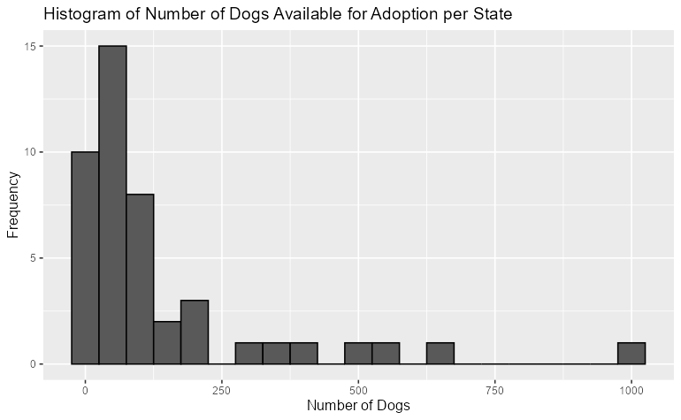
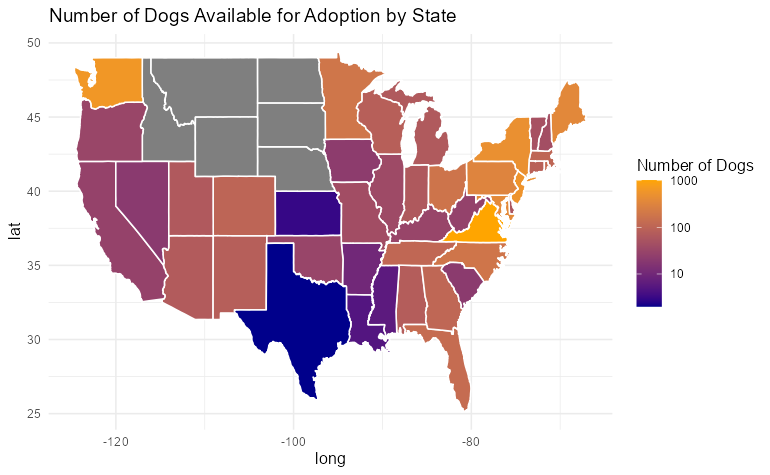
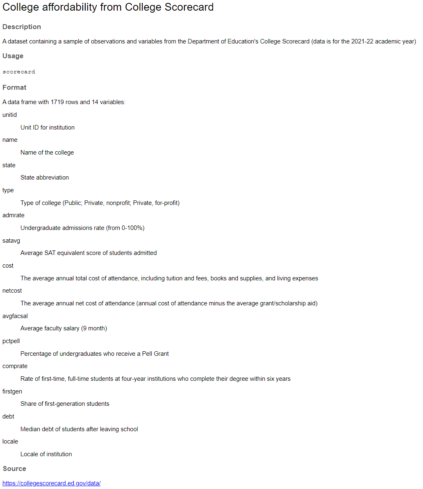

# COMP4010/5120 Data Visualization - Homework 3 Question Set

This assignment requires you to demonstrate your knowledge of visualizing geospatial data (choropleth map), creating and publishing an interactive Shiny dashboard. Additionally, you will also be introduced to `DALEX`, a library for ML model intepretation. This was supposed to be covered during an AE sessio, however due to scheduling, a brief introductory exercise will be included here instead.

The assignment is seperated into 3 main sections, each using a different dataset.

The maximum points for this assignment is **20 points**.

# Submission requirements

Similar to the weekly AEs and prior homeworks, you should submit your work in 2 formats: `Rmd` and `pdf` to Canvas.
The entire assignment should be contained in 1 `Rmd` file.

Answers for non-coding questions should be added in the file as plain text in the provided `ANSWER` field.

# Section 1: Studying popularity of baby names

For this set of exercises, we are going to use the [`babynames` dataset](https://hadley.github.io/babynames/). 

Install the dataset by running:

```R
# Install the released version from CRAN
install.packages("babynames")

library(babynames)

applicants_df <- applicants
babynames_df <- babynames
lifetables_df <- lifetables
births_df <- births
```

The four included datasets in this package are:

- `babynames`: For each year from 1880 to 2017, the number of children of each sex given each name. All names with more than 5 uses are given.

- `applicants`: The number of applicants for social security numbers (SSN) for each year for each sex.

- `lifetables`: Cohort life tables data.

It also includes the following data set from the US Census:

- `births`: Number of live births by year, up to 2017.
You may need to use multiple files, but the most important one is `babynames`. Feel free to bring in additional data sources as you wish.

## Task 1: Shiny Dashboard for Baby Naming Trends (10 pts)

### Summary of task requirements

Design and implement a Shiny dashboard that reports on baby naming trends. The dashboard should appropriately use server-side interactivity.

1. **Originality**:
   - Avoid direct code copying from examples.
   - Create an original implementation.

2. **Inputs and Outputs**:
   - Use at least **two user inputs**.
   - Provide at least **three reactive outputs** (e.g., plots, tables, text).

3. **Components**:
   - Include at least:
     - One **plot**
     - One **table**
     - One **value box**
   - Utilize **plotly** for interactivity in at least one plot.

4. **Styling and Customization**:
   - Apply an **appropriate theme** for styling.
   - Optional: Customize further with **CSS/SCSS** if desired.

5. **Creativity and Beyond Basics**:
   - Extend beyond basic functionality.
   - Consider user experience, customization, interactivity, data sources, and insights.

6. **Publishing**:
   - Deploy the dashboard on **Shinyapps.io**.
   - Clearly print the **working app URL** in the rendered PDF for evaluation.

Remember to showcase creativity and thoughtful design in your implementation! Good luck! 

### Task description

**Create a Shiny dashboard to report on baby naming trends.** Design and implement a Shiny dashboard that appropriately uses server-side interactivity.

There are tons of examples online of Shiny apps made using the `babynames` package. You may use them for design inspiration but your implementation must be original. Don’t directly copy code from examples, and if you draw on specific features and/or code be sure to cite it.

- You must use at least two user inputs and three reactive outputs (e.g. plots, tables, text).

- The dashboard should include at least one plot, one table, and one value box.
- You should use `plotly` for at least one plot and customize it to maximize its interactivity.
- Use an appropriate theme for styling. Feel free to further customize with CSS/SCSS if you have background knowledge, but it’s not required.

**If you create a basic dashboard, expect a basic grade.** We’re looking for extending beyond the basics and some originality/creativity. Things you might think to incorporate into the dashboard:

- User experience: e.g. layout (pages, tabs, arrangement of cards, etc.), design, etc.
- Customization: e.g. color palettes, themes, fonts, customized theme() to blend ggplot2 plots with the dashboard theme, etc.
- Interactivity: e.g. hover effects, click events, etc.
- Data: e.g. more than just babynames.csv, additional data sources, data wrangling, etc.
- Insights: e.g. text boxes, value boxes, etc.

The dashboard should be published using Shinyapps.io and the URL for the working app clearly printed in your rendered PDF so we can easily access it during the evaluation. You will need to create an account on Shinyapps.io but the free tier should be sufficient for this assignment.

# Section 2: Adopt, don’t shop

The data for this exercise comes from [The Pudding](https://github.com/the-pudding/data/blob/master/dog-shelters/README.md) via [TidyTuesday](https://github.com/rfordatascience/tidytuesday/tree/master/data/2019/2019-12-17).

You will also need to have the 2 packages: `ggmap` and `maps`. For your convenience, a dataframe with the US state names and their corresponding abbreviations is provided.

```R
#install.packages("ggmaps")
library(ggmap)

#install.packages("maps")
library(maps)

state_abbreviations <- data.frame(
  state_name = c("Alabama", "Alaska", "Arizona", "Arkansas", "California", "Colorado", 
                 "Connecticut", "Delaware", "Florida", "Georgia", "Hawaii", "Idaho", 
                 "Illinois", "Indiana", "Iowa", "Kansas", "Kentucky", "Louisiana", 
                 "Maine", "Maryland", "Massachusetts", "Michigan", "Minnesota", 
                 "Mississippi", "Missouri", "Montana", "Nebraska", "Nevada", 
                 "New Hampshire", "New Jersey", "New Mexico", "New York", 
                 "North Carolina", "North Dakota", "Ohio", "Oklahoma", "Oregon", 
                 "Pennsylvania", "Rhode Island", "South Carolina", "South Dakota", 
                 "Tennessee", "Texas", "Utah", "Vermont", "Virginia", "Washington", 
                 "West Virginia", "Wisconsin", "Wyoming"),
  state_abbr = c("AL", "AK", "AZ", "AR", "CA", "CO", "CT", "DE", "FL", "GA", "HI", "ID", 
                 "IL", "IN", "IA", "KS", "KY", "LA", "ME", "MD", "MA", "MI", "MN", 
                 "MS", "MO", "MT", "NE", "NV", "NH", "NJ", "NM", "NY", "NC", "ND", 
                 "OH", "OK", "OR", "PA", "RI", "SC", "SD", "TN", "TX", "UT", "VT", 
                 "VA", "WA", "WV", "WI", "WY")
)
```

## Task 2: Exploring dog adoption dataset in the US (8 pts)

### Summary of task requirements

- Create a dataframe containing the number of dogs available to adopt per `contact_state`
- Create a histogram of the number of dogs available to adopt and describe the distribution of this variable.
- Create a choropleth map where each state is filled in with a color based on the number of dogs available to adopt in that state.

### Task description

- Load the `data/dog_travel.csv` dataset included with `read_csv()`.

- Calculate the number of dogs available to adopt per `contact_state`. Save the result as a new data frame with 2 columns `contact_state` and `n`. Your new dataframe should look similar to the following example:


- Make a histogram of the number of dogs available to adopt and describe the distribution of this variable. Use `binwidth = 50`. Your plot may look like the following example:



- Use this dataset to make a map of the US states, where each state is filled in with a color based on the number of dogs available to adopt in that state.



*Hints*:

- Use the `state_abbreviations` dataframe which you can find in the data folder of your repo as a lookup table to match state names to abbreviations.
- Use a gradient color scale and `log10` transformation.

# Section 3. DALEX basics with explainer

To start, make sure you have the following packages installed.

```R
# packages for wrangling data and the original models
library(tidyverse)
#install.packages('tidymodels')
library(tidymodels)
#install.packages('rcis')
library(rcis)

# packages for model interpretation/explanation
#install.packages('DALEX')
library(DALEX)
#install.packages('DALEXtra')
library(DALEXtra)
#install.packages('rattle')
library(rattle) # fancy tree plots

# set random number generator seed value for reproducibility
set.seed(4010)
```

In this task we will utilize the `scorecard` dataset. With this dataset, we will intepret a set of machine learning models predicting the median student debt load for students graduating in 2020-21 at four-year colleges and universities as a function of university-specific factors (e.g. public vs. private school, admissions rate, cost of attendance).

To read about the dataset, run `help(scorecard)` after importing `rcis`.



We have estimated three distinct machine learning models to predict the median student debt load for students graduating in 2020-21 at four-year colleges and universities. Each model uses the same set of predictors, but the algorithms differ. Specifically, we have estimated

- Random forest
- Penalized regression
- 10-nearest neighbors
All models were estimated using tidymodels. We will load the training set, test set, and ML workflows from `data/scorecard-models.Rdata`.

```R
# load Rdata file with all the data frames and pre-trained models
load("data/scorecard-models.RData")
```

In order to generate our interpretations, we will use the [DALEX package](https://dalex.drwhy.ai/). The first step in any DALEX operation is to create an **explainer object**. This object contains all the information needed to interpret the model’s predictions. We will create explainer objects for each of the three models.

For example, we can create an explainer object for the Penalized regression model (GLMNet) with:

```R
# use explain_*() to create explainer object
# first step of an DALEX operation
explainer_glmnet <- explain_tidymodels(
  model = glmnet_wf,
  # data should exclude the outcome feature
  data = scorecard_train |> select(-debt),
  # y should be a vector containing the outcome of interest for the training set
  y = scorecard_train$debt,
  # assign a label to clearly identify model in later plots
  label = "penalized regression"
)
```

## Task 3: Create explainer objects (1 pt)

### Summary of task requirements

Fill in the `TODO` fields in the given snippets.

### Task description

Review the syntax below for creating explainer objects using the `explain_tidymodels()` function. Then, create explainer objects for the random forest and 
k-nearest neighbors models. Fill in the `TODO` fields in the given snippets provided below.

```R
# explainer for random forest model
explainer_rf <- explain_tidymodels(
  model = TODO,
  data = scorecard_train |> select(-debt),
  y = scorecard_train$debt,
  label = "TODO"
)

# explainer for nearest neighbors model
explainer_kknn <- explain_tidymodels(
  model = TODO,
  data = scorecard_train |> select(-debt),
  y = scorecard_train$debt,
  label = "TODO"
)
```

## Task 4: Feature importance (1 pt)

### Summary of task requirements

Run the given snippets, and provide a **short answer (1 sentence)** in the `ANSWER` field included in the comment.

### Task description

The DALEX package provides a variety of methods for interpreting machine learning models. One common method is to calculate feature importance. Feature importance measures the contribution of each predictor variable to the model’s predictions. We will use the `model_parts()` function to calculate feature importance for the random forest model. It includes a built-in `plot()` method using `ggplot2` to visualize the results.

Here is an example, run this snippet and see what happens:

```R
# generate feature importance measures
vip_rf <- model_parts(explainer_rf)
vip_rf

# visualize feature importance
plot(vip_rf)
```

Next, we want to examine the difference when using the ratio of the raw change in the loss function instead. Run the following snippet, examine the output and compare with the plot above.

```R
# Question: Calculate feature importance for the random forest model using the ratio of the raw change in the loss function. How does this differ from the raw change?
# ANSWER: YOUR ANSWER HERE

# calculate ratio rather than raw change
model_parts(explainer_rf, type = "ratio") |>
  plot()
```
