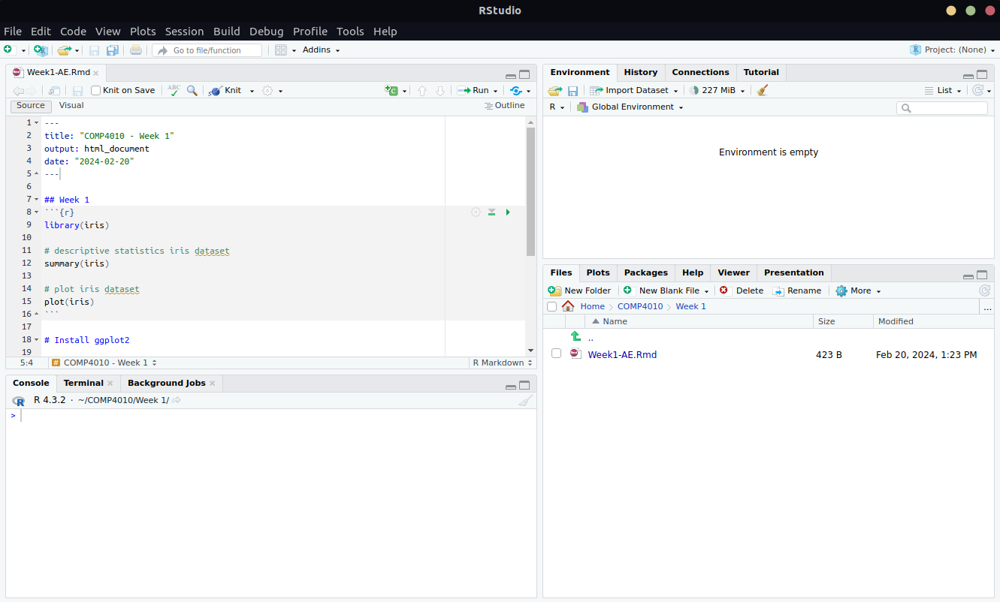

# COMP4010 - Week 1 Application Exercise

You can find the Notion version of this booklet here (images may not load if you’re viewing on GitHub): 

[COMP4010 - Week 1 Application Exercise](https://www.notion.so/COMP4010-Week-1-Application-Exercise-a78a2f694f8a48f185556b98bf074d2e?pvs=21)

*Cover image by the wonderful [Visual Cinnamon](https://www.visualcinnamon.com/portfolio/)*

---

# Introduction to R

### Overview of R

R is a powerful language and environment for statistical computing and graphics. It is highly extensible and offers a wide variety of statistical and graphical techniques, including linear and nonlinear modeling, statistical tests, time series analysis, classification, clustering, and more. R is open source and freely available, making it a popular choice in academia, research, and industry for data analysis and visualization tasks.

R is particularly noted for its rich ecosystem of packages, especially for data visualization (like ggplot2), and its vibrant community. Its integrated suite of software facilities makes it easy to manipulate data, perform calculations, and display the results graphically.

To install R and RStudio, follow the instructions here:

[https://rstudio-education.github.io/hopr/starting.html](https://rstudio-education.github.io/hopr/starting.html)

### R and Python: Comparing and Contrasting

While Python is a general-purpose language with strong capabilities in data analysis and visualization, R is a specialized language for statistical analysis. Here are some key comparisons:

- **Purpose**: Python is versatile, used for web development, automation, and data science, while R is specifically designed for data analysis and statistical computing.
- **Libraries**: Both have extensive libraries for data analysis. Python has Pandas, NumPy, and Matplotlib, while R has `dplyr`, `tidyr`, and `ggplot2`.
- **Syntax**: Python is known for its readability and ease of use. R, while having a steeper learning curve, offers advanced statistical functions out of the box.
- **Community**: Python has a broader user base, while R's community is highly specialized in statistics and data analysis.

### Navigating RStudio Interface

RStudio is an integrated development environment (IDE) for R. It includes a console, syntax-highlighting editor, and tools for plotting, history, debugging, and workspace management. Key areas of the RStudio interface include:

- **Console**: Where R code is executed.
- **Script Editor**: Where you can write and edit R scripts.
- **Environment/History**: Displays your current workspace and command history.
- **Files/Plots/Packages/Help**: A panel for file management, graphical outputs, package management, and documentation.



There are many ways to store and execute R code, namely: R script (`.R`), R Markdown (`.Rmd`), or R Notebook (which is an `Rmd` file but with extra stuff). For this course, we recommend sticking to R Markdown for ease of use.

---

## R in VSCode

Alternatively, you may wish to use VSCode for your R development. You can follow the instructions here to set it up on your local machine: 

[](https://code.visualstudio.com/docs/languages/r)

### Basic R Syntax and Operations

- **Variables**: Assign values with **`<-`** or **`=`**. E.g., **`x <- 10`** or **`x = 10`**.
- **Data Types**: Includes vectors, lists, matrices, data frames, and factors.
    - **Vectors**: Basic data structure, created using **`c()`**. E.g., **`v <- c(1, 2, 3)`**.
    - **Data Frames**: Tabular data, similar to Python's Pandas DataFrame.
- **Basic Functions**: Use functions like **`mean()`**, **`sum()`**, **`length()`**.
- **Packages**: Enhance R’s functionality. Install with **`install.packages("package_name")`** and load with **`library(package_name)`**.

## Running code in R Markdown

R Markdown works with executable code chunks and markdown text sections. By default the plain text input in the file will be considered markdown input (so you can use markdown notations for formatting). To create an executable chunk in R Markdown, use the ````` symbols with the tag `{r}`   to signify a chunk should be considered a piece of runnable R code. Note that since R is a scripting language, you can run the code line-by-line or by chunk. Run the following chunk and check the output which should be displayed below the chunk in RStudio.

```python
```{r}
# c() is for 'concatenate' or 'combine'
# this is essentially 'combining' 4 single-element vectors
# into a vector of 4 integers (R treats values as single-element vectors).
myVector <- c(1,2,3,4)
mean(myVector)
```
```


---

# Introduction to CRAN and Package Management in R

The Comprehensive R Archive Network (CRAN) is a repository of R packages. It's the primary resource for extending the capabilities of R. As of my last update, CRAN hosted over 15,000 packages, covering a wide range of functionalities, from data manipulation and statistical modeling to advanced graphics and machine learning.

**Key Points about CRAN:**

- **Centralized Repository**: CRAN provides a centralized place to find and install R packages.
- **Quality Control**: Packages on CRAN are subject to a submission process that includes checks for documentation and compatibility.
- **Ease of Access**: Packages can be easily installed directly from CRAN within the R environment.

### Package Management in R

Managing packages in R involves primarily two functions: **`install.packages()`** for installation and **`library()`** or **`require()`** for loading a package into your R session.

1. **Installing Packages**: Use **`install.packages("package_name")`** to download and install a package from CRAN. This only needs to be done once per package unless updates are released.
2. **Loading Packages**: Once installed, a package can be loaded into your current R session using **`library(package_name)`**. This needs to be done each time you start a new R session and want to use the package.

### Demonstration: Installing ggplot2

`ggplot2` is one of the most popular packages in R for creating complex and beautiful graphics using the grammar of graphics. To install `ggplot2`:

1. Type the following command in your R console:
    
    ```r
    install.packages("ggplot2")
    ```
    
2. R will download and install the `ggplot2` package and its dependencies from CRAN.

### Loading ggplot2 Package

Once ggplot2 is installed, it needs to be loaded into your R session to use it:

1. Type the following command in your R console:
    
    ```r
    library(ggplot2)
    ```
    
2. After this command, `ggplot2` functions will be available in your session.

### Best Practices for Package Management

- **Updating Packages**: Regularly update your packages to get new features and bug fixes. Use **`update.packages()`**.
- **Managing Dependencies**: Some packages depend on others; R automatically handles these dependencies during installation.
- **Version Control**: Sometimes, specific versions of packages are required, especially for reproducibility in projects.

Understanding CRAN and the package management system in R is crucial for extending the functionality of your R environment. With these skills, you are well-equipped to install and load any package, including `ggplot2`, which you will use extensively for data visualization tasks.

### Introduction to the Grammar of Graphics and ggplot2 Syntax

`ggplot2`, created by Hadley Wickham, is based on the concept of the ***grammar of graphics***. This idea conceptualizes a plot as a coherent system, similar to a language. The grammar of graphics allows for the creation of complex and customizable plots from simple components.

**Key Components of `ggplot2` Grammar:**

- **Data**: The raw data that you want to plot.
- **Aesthetics (`aes`)**: Defines how variables in the data are mapped to visual properties (aesthetics) of the plot such as size, shape, color, x and y axes.
- **Geometries (`geom`)**: The geometric shapes that represent the data (points, lines, bars).
- **Facets**: For creating small multiples.
- **Statistics (`stat`)**: Statistical transformations to perform on the data (e.g., binning, counting, regression).
- **Coordinates**: The system to use for plotting (e.g., Cartesian, polar).
- **Themes**: Visual customizations outside of the data representation (like background color, grid lines).

### Creating a Simple Scatter Plot

A scatter plot is a type of data visualization that uses dots to represent the values obtained for two different variables - one plotted along the x-axis and the other plotted along the y-axis.

**Example: Scatter Plot with mtcars Dataset**

```r
ggplot(data = mtcars, aes(x = wt, y = mpg)) + geom_point()
```

This command creates a scatter plot using the **`mtcars`** dataset, plotting **`wt`** (weight) on the x-axis and **`mpg`** (miles per gallon) on the y-axis.


### Building a Bar Plot with Iris Dataset

Bar plots are useful for displaying the frequency of different categories.

**Example: Bar Plot with Iris Dataset**

```r
ggplot(data = iris, aes(x = Species, fill = Species)) + geom_bar()
```

This command creates a bar plot using the **`iris`** dataset, with different species on the x-axis and the count of each species shown as the height of the bars. The **`fill`** aesthetic is used to color the bars based on the species.


### Customizing Plots

Customizations can enhance the readability and aesthetic appeal of a plot.

- **Adding Titles and Labels**:
    
    ```r
    ggplot(data = mtcars, aes(x = wt, y = mpg)) +
      geom_point() +
      ggtitle("Scatter Plot of mpg vs wt") +
      xlab("Weight") +
      ylab("Miles Per Gallon")
    ```
    
    
    
- **Changing Colors**:
You can change the color of points in a scatter plot, for example:
    
    ```r
    ggplot(data = mtcars, aes(x = wt, y = mpg, color = factor(cyl))) +
      geom_point()
    ```
    
    This command will color the points based on the number of cylinders (**`cyl`**).
    
    
    
    ---
    

# **Practice Examples for Data Visualization with `ggplot2`**

### 1. Experimenting with the Iris Dataset

- **Dataset**: Iris (available in R by default)
- **Task**: Create a scatter plot showing the relationship between petal length and petal width, colored by species.
- **Customization**: Add a smooth regression line for each species.
    
    ```r
    ggplot(iris, aes(x = Petal.Length, y = Petal.Width, color = Species)) +
        geom_point() +
        geom_smooth(method = "lm") +
        ggtitle("Petal Length vs Width by Species") +
        theme_minimal()
    ```
    
    
    

### 2. Visualizing the mtcars Dataset

- **Dataset**: mtcars (available in R by default)
- **Task**: Create a bar plot showing the average miles per gallon (mpg) for cars with different numbers of cylinders.
- **Customization**: Use a different fill color for each cylinder type and add labels for the average mpg.
    
    ```r
    ggplot(mtcars, aes(x = factor(cyl), y = mpg, fill = factor(cyl))) +
        geom_bar(stat = "summary", fun = mean) +
        geom_text(stat = 'summary', aes(label = round(..y.., 1)), vjust = -0.5) +
        labs(x = "Number of Cylinders", y = "Average Miles per Gallon", title = "Average MPG by Cylinder Count") +
        theme_bw()
    ```
    
    
    

### 3. Exploring the gapminder Dataset

- **Dataset**: gapminder (install using **`install.packages("gapminder")`** and then **`library(gapminder)`**)
- **Task**: Create a line plot showing GDP per capita over time for select countries.
- **Customization**: Use different line types and colors for each country.
    
    ```r
    ggplot(subset(gapminder, country %in% c("Japan", "United Kingdom", "United States")),
           aes(x = year, y = gdpPercap, color = country, linetype = country)) +
        geom_line() +
        scale_y_log10() +
        ggtitle("GDP Per Capita Over Time") +
        theme_light()
    ```
    
    
    

### 4. Working with the diamonds Dataset

- **Dataset**: diamonds (part of ggplot2 package)
- **Task**: Create a histogram of diamond prices, faceted by cut quality.
- **Customization**: Adjust the bin width and use a theme that enhances readability.
    
    ```r
    ggplot(diamonds, aes(x = price)) +
        geom_histogram(binwidth = 500) +
        facet_wrap(~cut) +
        labs(title = "Diamond Prices by Cut Quality", x = "Price", y = "Count") +
        theme_classic()
    ```
    
    
    

### General tips:

- **Explore Different Geoms**: Try **`geom_bar`**, **`geom_line`**, **`geom_histogram`**, **`geom_boxplot`**, etc.
- **Play with Aesthetics**: Experiment with changing colors, shapes, sizes, and alpha transparency.
- **Try Faceting**: Use **`facet_wrap`** or **`facet_grid`** for multi-panel plots.
- **Modify Themes**: Test out various **`theme_`** options like **`theme_minimal`**, **`theme_light`**, **`theme_classic`**.
- **Add Annotations**: Use **`geom_text`** or **`annotate`** for labels and custom text.