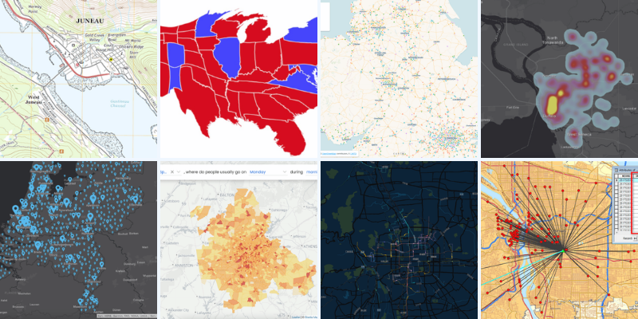
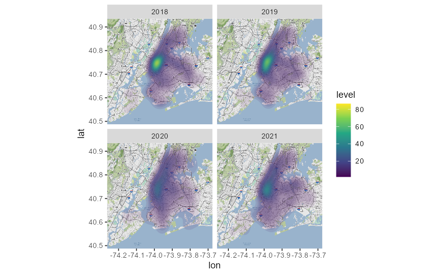
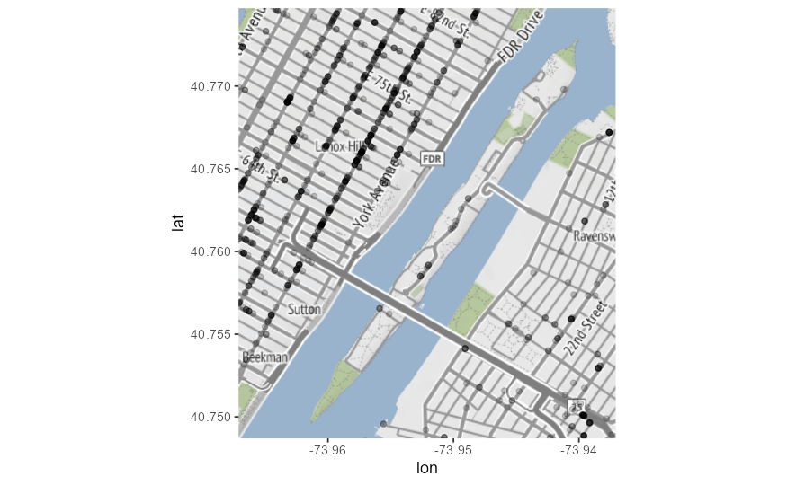
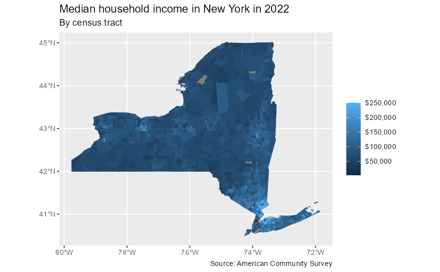
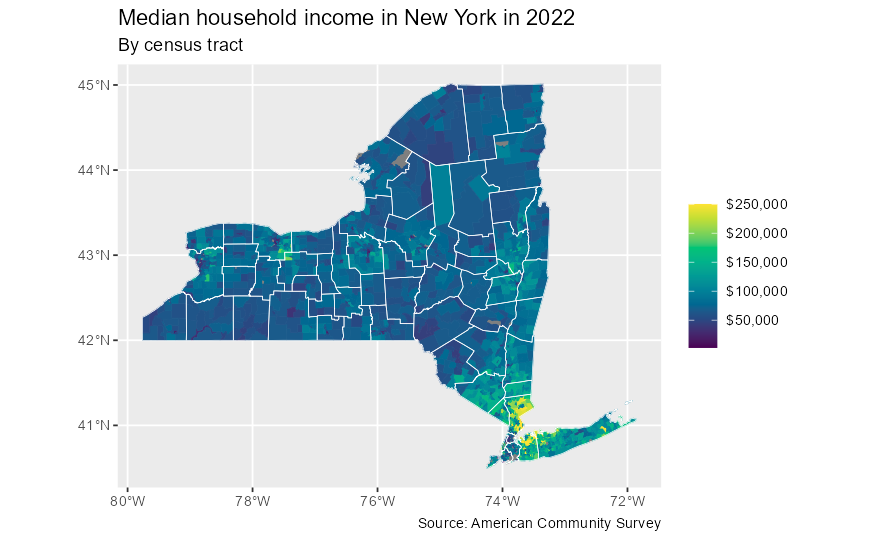
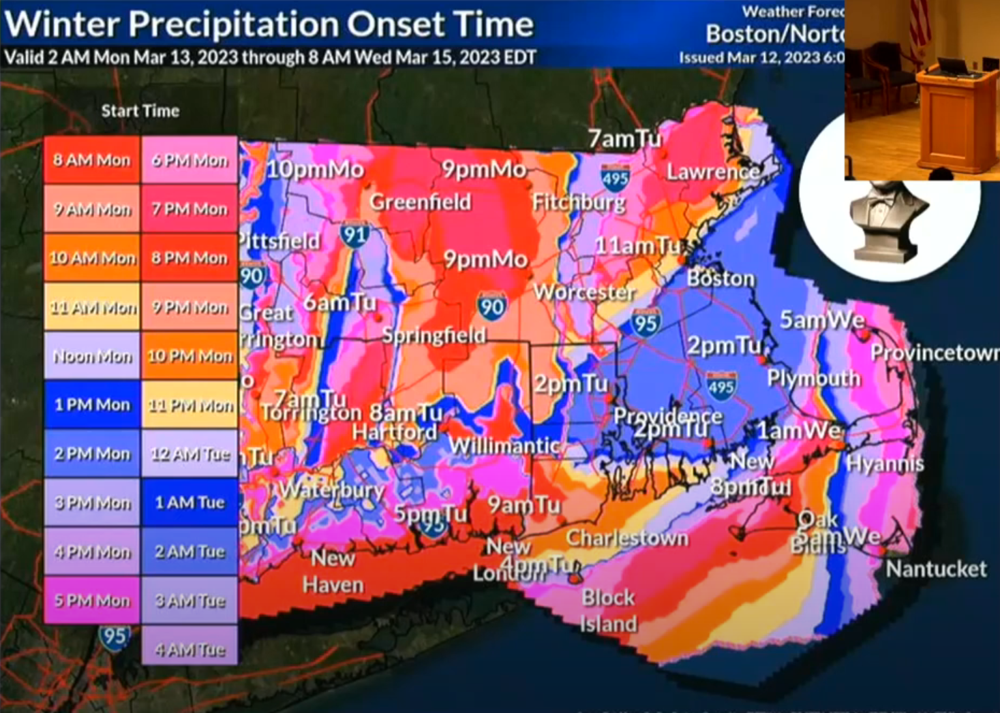
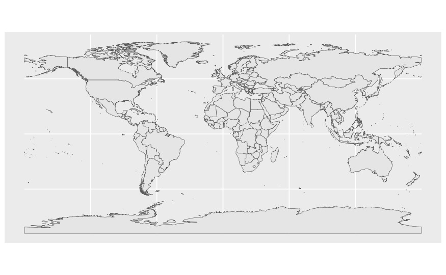

# COMP4010/5120 - Week 10 Application Exercises
---

# A. Application Exercises

**Data:** [`nyc-311.csv`](./nyc-311.csv), [`ny-inc.rds`](./ny-inc.rds), [`ny-counties.rds`](./ny-counties.rds)

```R
library(tidyverse)
#install.packages('ggmap')
library(ggmap)
```

Let’s first load a subset of 311 service requests in New York City. This subset includes 311 service requests related to Food Poisoning in commercial establishments (e.g. restaurants, cafeterias, food carts).

```R
nyc_311 <- read_csv(file = "nyc-311.csv", show_col_types = FALSE)
nyc_311
```

Store your Stadia Maps API key using the function:

```R
register_stadiamaps(key = "YOUR KEY HERE", write = TRUE)
```

## Task 1. Obtain map tiles for New York City

Use [bboxfinder.com] to find bounding box coordinates for New York City. Then, use `get_stamenmap()` to obtain map tiles for New York City and visualize the map.

> Try using a `zoom` level of 11.


## Task 2. Food poisoning rates

The COVID-19 pandemic caused massive disruption in the restaurant industry. Due to social distancing measures and lockdowns, restaurant traffic decreased significantly.

While this had significant financial ramifications, one potentially overlooked consequence is the impact on food poisoning rates. With fewer people eating out, the number of food poisoning complaints may have decreased.

Visualize the geospatial distribution of complaints related to food poisoning in NYC in March, April, and May over a four-year time period (2018-21). Construct the chart in such a way that you can make valid comparisons over time and geographically. What impact did COVID-19 have on food poisoning cases in NYC? Did it vary geographically?



# Task 3. Visualize food poisoning complains on Roosevelt Island

Now focus on food poisoning complaints on or around Roosevelt Island.2 Use get_stamenmap() to obtain map tiles for the Roosevelt Island region and overlay with the food poisoning complaints. What type of chart is more effective for this task?

> Consider adjusting your `zoom` for this geographic region.



---

# For the next tasks: New York 2022 median household income

We will use two data files for this analysis. The first contains median household incomes for each census tract in New York from 2022. The second contains the boundaries of each county in New York.

```R
# useful on MacOS to speed up rendering of geom_sf() objects
if (!identical(getOption("bitmapType"), "cairo") && isTRUE(capabilities()[["cairo"]])) {
  options(bitmapType = "cairo")
}

# create reusable labels for each plot
map_labels <- labs(
  title = "Median household income in New York in 2022",
  subtitle = "By census tract",
  color = NULL,
  fill = NULL,
  caption = "Source: American Community Survey"
)

# load data
ny_inc <- read_rds(file = "ny-inc.rds")
ny_counties <- read_rds(file = "ny-counties.rds")
```

# Task 4. Draw a continuous choropleth of median household income

Create a choropleth map of median household income in New York. Use a continuous color gradient to identify each tract’s median household income. Use a continuous color gradient to identify each tract’s median household income.

> Use the stored `map_labels` to set the title, subtitle, and caption for this and the remaining plots.



**OPTIONAL:** Use `viridis` color palette.


# Task 5. Overlay county borders

To provide better context, overlay the NY county borders on the choropleth map using the data from `ny_counties`.



# B. Reading Material

## 1. Hall of Shame (is back!)



"[Jon Schwabish](https://policyviz.com/about/) is an economist who trains people to be better at data visualization." This week we don't have just one example for the Hall of Shame but a rather interesting video going through numerous bad examples of data visualization used in real life, along with the comments of Professor Jon Schwabish.

Check out the video here: [What Not to do in Data Visualization: A Walk through the Bad DataViz Hall of Shame](https://www.youtube.com/watch?v=KluzR75S6U0)

> Talk abstract: Prepare to be amused and enlightened as we embark on a comical journey through the quirky world of bad data visualizations. In this light-hearted talk, I’ll showcase some of the most outrageous and baffling data visual blunders that have left audiences scratching their heads. From pie charts that vie you everything to bar charts that distort and mislead, you’ll see it all. I mix the comical with the serious to unveil visual missteps in the data world. Amidst the 3D exploding charts, you'll also glean valuable lessons on what not to do when crafting data visualizations. Join me for a rollicking exploration of data gone wrong and leave with a smile and a newfound appreciation for the importance of clarity and accuracy in our data-driven endeavors.


## 2. Getting a Stadia Maps API Key

[Stadia Maps](https://stadiamaps.com/) is a readily available collection of APIs related to maps and geolocations. To get started with this week exercises, you should sign up for a Stadia Maps API key following [this guide](https://search.r-project.org/CRAN/refmans/ggmap/html/register_stadiamaps.html).

## 3. Introduction to `ggmap` in R

The `ggmap` package is a valuable tool for R users who work with spatial visualization. It serves as an extension to the popular `ggplot2` package, enabling the integration of map data with the customizable plotting capabilities of `ggplot2`. Whether you are a data scientist, a geospatial analyst, or just someone interested in mapping data, `ggmap` offers a flexible and powerful approach to creating detailed and aesthetically pleasing maps.

The primary feature of `ggmap` is its ability to download and render map tiles from popular mapping services like Google Maps, OpenStreetMap, and Stamen Maps. This allows users to overlay their data onto these maps, creating rich, interactive visualizations that can convey complex geographical data in an intuitive way.

`ggmap` simplifies the process of geocoding addresses into latitude and longitude coordinates and vice versa, making it easier to plot location-based data. Additionally, it supports the customization of base maps, enabling users to adjust the aesthetic elements such as color schemes, annotations, and layers to suit specific needs.

In the following sections, we will delve into how to install `ggmap`, retrieve maps, geocode data, and customize your maps to tell stories with your data effectively. Whether you are plotting simple location data or conducting complex spatial analysis, `ggmap` provides the tools necessary to produce insightful and visually engaging maps.

A great introduction to `ggmap` can be found here: [ggmap: Spatial Visualization with ggplot2](https://journal.r-project.org/archive/2013-1/kahle-wickham.pdf)

## 4. Choropleth map

A choropleth map is a type of thematic map where areas are shaded or patterned in proportion to the measurement of a statistical variable being displayed on the map, such as population density or per-capita income. The purpose of a choropleth map is to provide an easy visual way to compare data across geographic regions without needing to understand precise values.

Key characteristics of choropleth maps include:

- **Data Classification**: Data is typically classified into different categories or ranges, such as income levels or temperature ranges. These categories are then assigned different colors or patterns.
- **Color Schemes**: Choropleth maps use color gradients to represent different data ranges. Warmer colors (e.g., red, orange) might represent higher values, while cooler colors (e.g., blue, green) might represent lower values. The choice of colors can significantly affect the readability and interpretability of the data.
Geographic Units: The map is divided into spatial units such as countries, states, counties, or districts. Each unit is filled with a color corresponding to the data value for that area.
- **Simplicity and Accessibility**: These maps make complex data more accessible and understandable to a broad audience, facilitating easier comparison and analysis of regional data.

Choropleth maps are widely used in various fields such as meteorology, public health, economics, and political science to visualize and analyze spatial data distributions. However, they also have limitations, such as potentially misleading interpretations if the areas of the geographic units vary significantly in size, or if the data is not normalized (e.g., total values vs. per capita).

> However, its downside is that regions with bigger sizes tend to have a bigger weight in the map interpretation, which includes a bias. - [from Data to Viz](https://www.data-to-viz.com/graph/choropleth.html)


## 5. Geographic Information System (GIS) Data and the `sf` library

A geographic information system (GIS) is a computer system for capturing, storing, checking, and displaying data related to positions on Earth’s surface. GIS can show many different kinds of data on one map, such as streets, buildings, and vegetation. This enables people to more easily see, analyze, and understand patterns and relationships. ([National Geographic](https://education.nationalgeographic.org/resource/geographic-information-system-gis/))

The `sf` package in R stands for "simple features" and is a modern approach to handling spatial and geographic data within the R programming environment. The package provides classes and functions to manipulate, process, and visualize spatial data, integrating well with the tidyverse suite of packages for data analysis.

We can combine GIS data and the `sf` library to draw vector shapes based on geographical data such as country or state borders. For example, to draw a vector border of a state using GIS data in R with the `geom_sf()` function from the `sf` package, you'll need to follow a few key steps. This involves obtaining spatial data in a vector format, preparing the data, and then plotting it. 

You can get the spatial data from various sources such as the `rnaturalearth` and `rnaturalearthdata` libraries and use it directly with the `sf` library:

```R
#install.packages("rnaturalearth")
#install.packages("rnaturalearthdata")
library(rnaturalearth)
library(rnaturalearthdata)

world <- ne_countries(scale = "medium", returnclass = "sf")
ggplot(data = world) +
    geom_sf()
```

