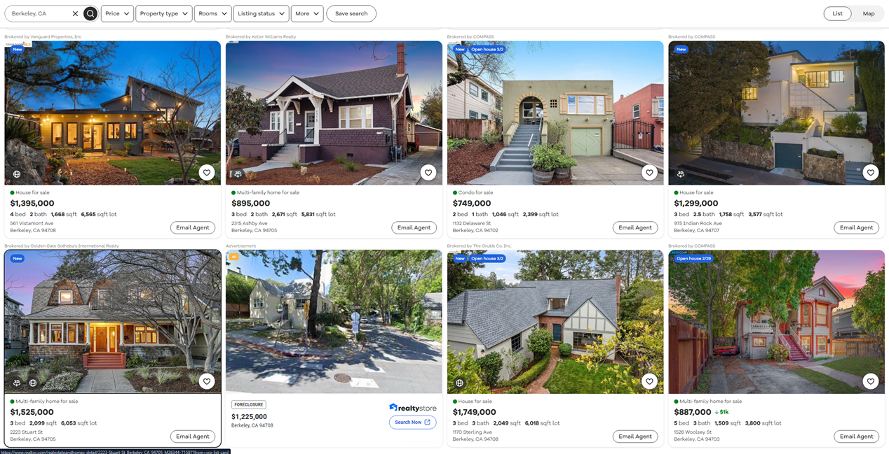

# COMP4010/5120 - Week 2 Application Exercises

---

# Submission requirements:

- For each week, you will need to submit **TWO** items to Canvas: Your R Markdown file in `.Rmd` and `.pdf` formats. You can export `.Rmd` to `.pdf` by using the Knit functionality. If you’re not sure how to do that please check out this video: [Tutorial on how to Knit R Markdown](https://youtu.be/8eBBPVMwTLo?si=93Vo8OOApf0vAYYH).
- In the R Markdown file please provide your answers to the provided exercises (both theory and programming questions).
- Answers to theory questions should be included in markdown as plain text. Answers to programming questions should be included in executable R chunks (more information in **Reading Material Section A.2.4**).

---

# A. Application Exercises

## Task 1. Visualizing the house sales data as a lollipop chart

Following the content from Section B.3, plot the mean area of houses by decade built using a [lollipop chart](https://www.data-to-viz.com/graph/lollipop.html). 

**Hint:** Think of what **geometric primitives** you need to create a lollipop chart? Refer to [this handy cheatsheet](https://rstudio.github.io/cheatsheets/html/data-visualization.html) and find the geoms you need.

Your plot should look something (may not need to be exactly) like this:

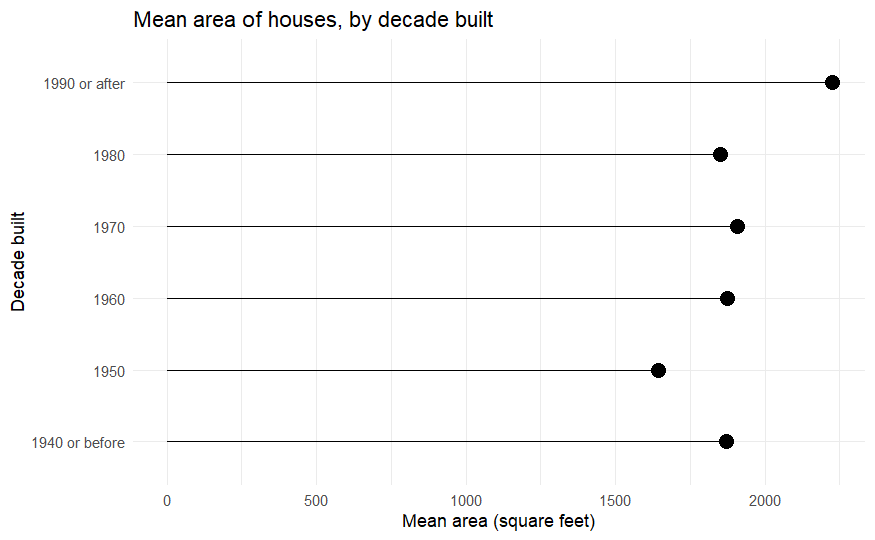

## Task 2. Visualizing the distribution of the number of bedrooms 

Your task is to visualize the distribution of the number of bedrooms. To simplify the task, let’s collapse the variable beds into a smaller number of categories and drop rows with missing values for this variable.
```R
df_bed <- df |>
  mutate(beds = factor(beds) |>
    fct_collapse(
      "5+" = c("5", "6", "7", "9")
    )) |>
  drop_na(beds)
```
Since the number of bedrooms is effectively a categorical variable, we should select a geom appropriate for a single categorical variable.
Create a bar chart visualizing the distribution of the number of bedrooms in the properties sold. Your plot should look something (may not need to be exactly) like this:

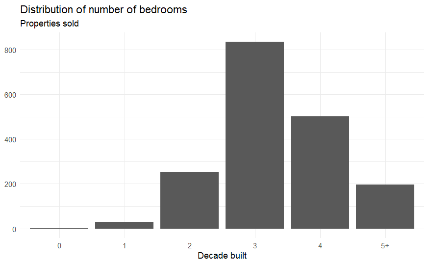

## Task 3. Visualizing the distribution of the number of bedrooms by the decade in which the property was built
Now let’s visualize the distribution of the number of bedrooms by the decade in which the property was built. We will still use a bar chart but also color-code the bar segments for each decade. Now we have a few variations to consider.

- [**Stacked bar chart**](https://datavizproject.com/data-type/stacked-bar-chart/) - each bar segment represents the frequency count and are stacked vertically on top of each other.
- [**Dodged/Grouped bar chart**](https://chartio.com/learn/charts/grouped-bar-chart-complete-guide/) - each bar segment represents the frequency count and are placed side by side for each decade. This leaves each segment with a common origin, or baseline value of 0.
- [**Relative frequency bar chart**](https://www.researchgate.net/figure/Relative-frequency-bar-chart-of-settlement-classification-per-cluster-according-to-the_fig4_330763944) - each bar segment represents the relative frequency (proportion) of each category within each decade.

Generate each form of the bar chart and compare the differences. Which one do you think is the most informative?
*Hint:* Read the documentation for [geom_bar()](https://ggplot2.tidyverse.org/reference/geom_bar.html) to identify an appropriate argument for specifying each type of bar chart.

Your plot should look something (may not need to be exactly) like this:

**Stacked bar chart**

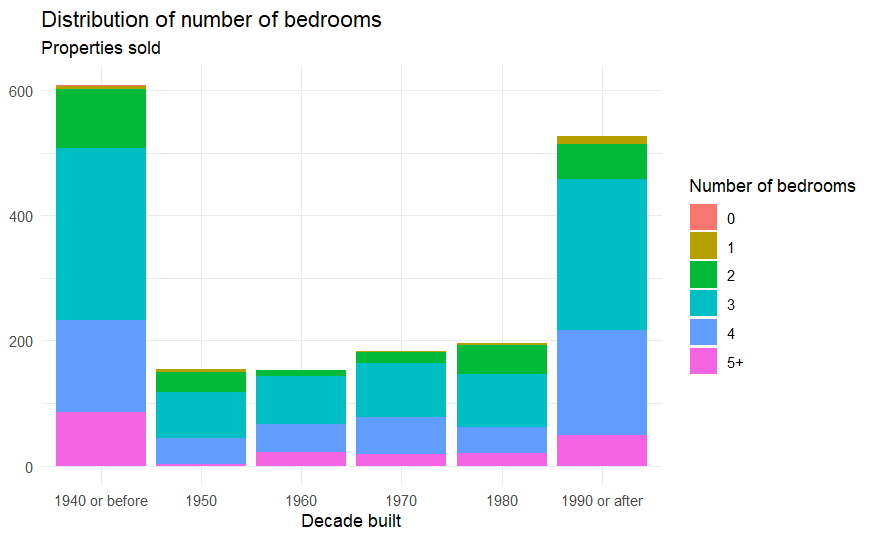

**Dodged bar chart**

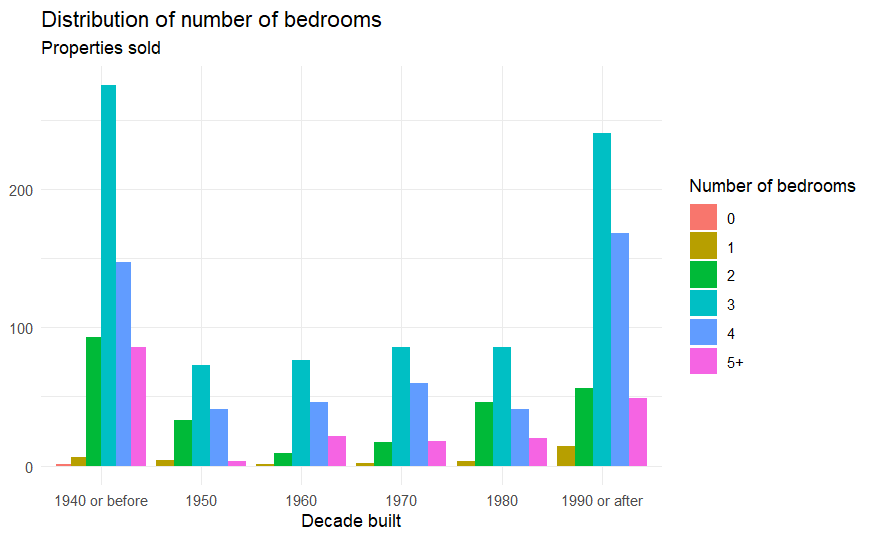

**Relative frequency bar chart**

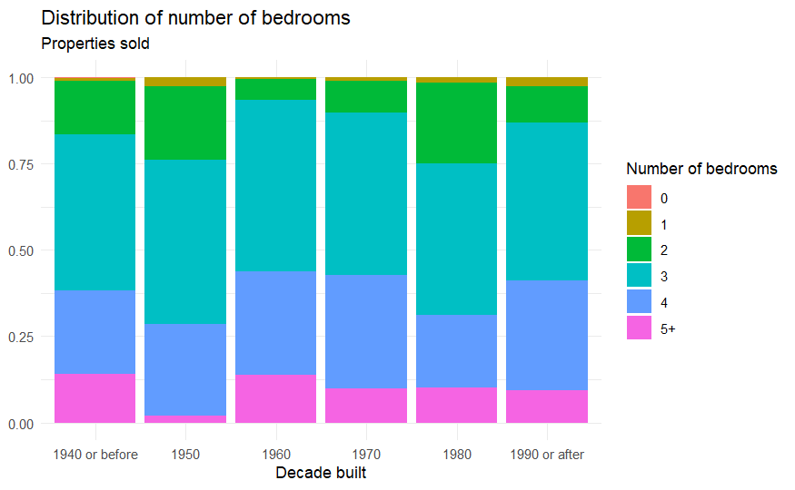

## Task 4. Visualizing the distribution of property size by decades

Now let’s evaluate the typical property size (`area`) by the decade in which the property was built. We will start by summarizing the data and then visualize the results using a bar chart and a boxplot.

```R
mean_area_decade <- df |>
  group_by(decade_built_cat) |>
  summarize(mean_area = mean(area))
```

Visualize the property size by the decade in which the property was built. Construct a bar chart reporting the average property size, as well as a [boxplot](https://r-graph-gallery.com/boxplot), [violin plot](https://r-graph-gallery.com/violin), and [strip chart](https://diametrical.co.uk/products/quickchart/advanced-charts/strip-charts/) (e.g. jittered scatterplot). What does each graph tell you about the distribution of property size by decade built? Which ones do you find to be more or less effective?

*Bonus*: [XKCD on Violin Plots](https://xkcd.com/1967/)

Your plot should look something (may not need to be exactly) like this:

**Bar chart (mean area by decade built)**
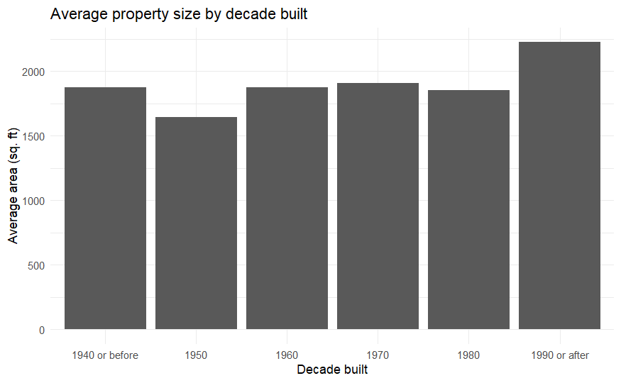

**Box plot (area by decade built)**
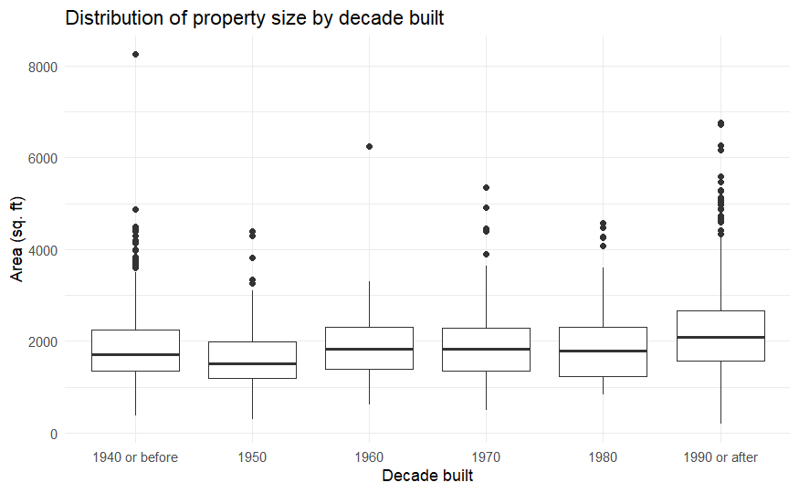

**Violin plot (area by decade built)**
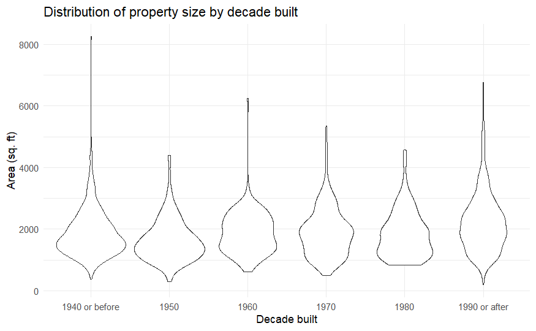

**Strip chart (area by decade built)**
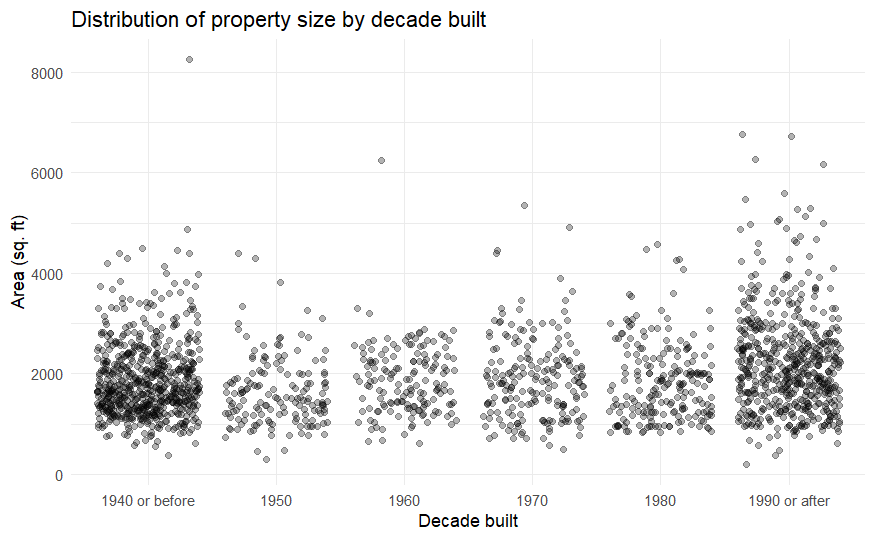


# B. Reading Material

## 1. Hall of ~~Fame~~ Shame

Learning from other's mistakes is immensely beneficial as it provides you with tangible examples of what not to do in your own visualizations.
The "Hall of Shame" is a curated collection of poorly executed visualizations that serve as cautionary examples of what to avoid in your own work. By examining these visualizations, we'll gain valuable insights into common pitfalls, ineffective techniques, and misleading representations. The "Hall of Shame" is not intended to ridicule or criticize, but rather to foster critical thinking, inspire improvement, and deepen our understanding of effective data communication.

For our first one, let's look at the most common sin of data viz: pie charts!

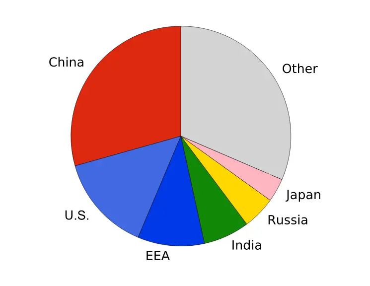

Here are some reasons why using a pie chart in this situation is not ideal:

- Difficulty comparing slices: As mentioned earlier, the human eye is not good at accurately judging the relative sizes of pie chart slices, especially for more than a few slices. This makes it difficult to compare the percentage of each country or region in this chart. For instance, it’s hard to tell at a glance which is larger, the slice for China or the one for “Other”.

- Limited data points: Pie charts are most effective when there are only a few data points to compare. This chart has six slices, which can make it visually complex and difficult to interpret.

A better alternative for this data visualization would be a bar chart. A bar chart would display the percentages for each country or region along a horizontal or vertical axis, making it easier to compare the magnitudes and identify the highest or lowest percentages.

## 2. Data-Ink Ratio: Less is More in Data Visualization

The data-ink ratio is a key principle in data visualization, emphasizing the importance of maximizing the proportion of ink used to represent the actual data compared to the total ink used in the entire visualization. This concept, championed by Edward Tufte, encourages creators to focus on essential elements that convey the data's message effectively.

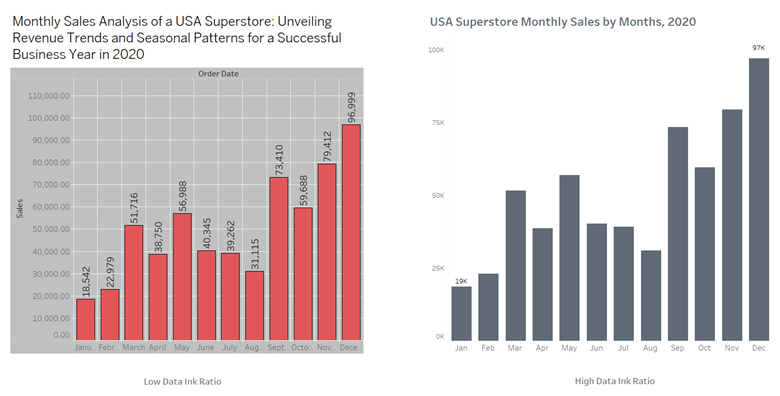

Why is a high data-ink ratio crucial in modern data viz designs?

- Clarity and Focus: By minimizing unnecessary visual elements like excessive decorations or overly complex chart structures, viewers can easily grasp the data's key points without being distracted by extraneous information. This leads to a clearer understanding of the message being conveyed.
- Efficiency and Impact: A high data-ink ratio promotes efficient use of visual space, allowing for the presentation of more data within the same area. This maximizes the impact of the visualization, enabling viewers to quickly extract insights from the data.
- Professionalism and Aesthetics: A focus on essential elements often translates to a cleaner and more professional visual design. This aesthetic simplicity fosters a sense of trust and reliability in the data presented.

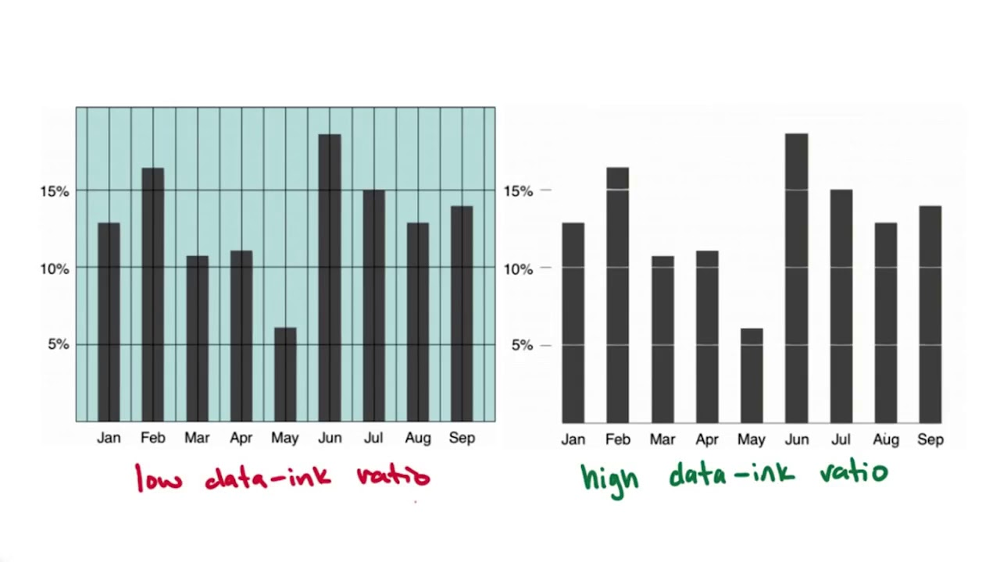

While not a strict quantitative measure, the data-ink ratio serves as a valuable guiding principle for data visualization professionals. By striving for a high data-ink ratio, creators can ensure their visualizations are clear, concise, and impactful, allowing viewers to effectively understand and utilize the presented information.

## 3. House Sales Data
For the following exercises we will work with data on houses that were sold in the state of New York (USA) in 2022 and 2023. 

The variables include:

- `property_type` - type of property (e.g. single family residential, townhouse, condo)
- `address` - street address of property
- `city` - city of property
- `state` - state of property (all are New York)
- `zip_code` - ZIP code of property
- `price` - sale price (in dollars)
- `beds` - number of bedrooms
- `baths` - number of bathrooms. Full bathrooms with shower/toilet count as 1, bathrooms with just a toilet count as 0.5.
- `area` - living area of the home (in square feet)
- `lot_size` - size of property’s lot (in acres)
- `year_built` - year home was built
- `hoa_month` - monthly HOA dues. If the property is not part of an HOA, then the value is `NA`

The dataset can be found in the repo for this week. It is called `homesales.csv`. We will import the data and create a new variable, `decade_built_cat`, which identifies the decade in which the home was built. It will include catch-all categories for any homes pre-1940 and post-1990.

First, you can read the data `csv` in R with:

```R
df <- read_csv("homesales.csv")
```

### 3.1. Average home size by decade

Let’s examine the average size of homes recently sold by their age. To simplify this task, we will split the homes by decade of construction. It will include catch-all categories for any homes pre-1940 and post-1990. Then we will calculate the average size of homes sold by decade.

```R
# create decade variable
df <- df |>
  mutate(
    decade_built = (year_built %/% 10) * 10,
    decade_built_cat = case_when(
      decade_built <= 1940 ~ "1940 or before",
      decade_built >= 1990 ~ "1990 or after",
      .default = as.character(decade_built)
    )
  )

# calculate mean area by decade
mean_area_decade <- df |>
  group_by(decade_built_cat) |>
  summarize(mean_area = mean(area))
mean_area_decade
```

This code snippet is using the pipe operator (`|>`) in R along with the `mutate()` function from the `dplyr` package to create two new variables (`decade_built` and `decade_built_cat`) based on an existing variable `year_built` in the dataframe `df`.

- The pipe operator (`|>`) passes the dataframe `df` into the next function, which is `mutate()`, making the dataframe the first argument of the `mutate()` function.
- `mutate()`: This function from the `dplyr` package is used to create new variables or modify existing ones in the dataframe.
- `decade_built = (year_built %/% 10) * 10`: This line calculates the decade in which each observation's `year_built` falls. It does this by dividing `year_built` by 10 (`year_built %/% 10`), which effectively truncates the year to the nearest decade. Then, it multiplies the result by 10 to obtain the decade. For example, if `year_built` is 1995, `(1995 %/% 10) * 10` would result in 1990.
- `decade_built_cat = case_when()`: This line creates a categorical variable `decade_built_cat` based on the decade information calculated in the previous step. It uses the `case_when()` function, which allows for conditional assignment based on multiple conditions.
- `decade_built <= 1940 ~ "1940 or before"`: This condition checks if the decade_built is less than or equal to 1940. If true, it assigns the value `"1940 or before"` to the `decade_built_cat`.
- `decade_built >= 1990 ~ "1990 or after"`: This condition checks if the decade_built is greater than or equal to 1990. If true, it assigns the value `"1990 or after"` to the `decade_built_cat`.
- `.default = as.character(decade_built)`: This is the default condition. If the `decade_built` does not fall into either of the specified ranges, it converts the decade into a character and assigns it to `decade_built_cat`.

### 3.2. Visualizing the data as a bar chart

A conventional approach to visualizing this data is a **bar chart**. Since we already calculated the average area, we can use `geom_col()` to create the bar chart. We also graph it horizontally to avoid overlapping labels for the decades.

```R
ggplot(
  data = mean_area_decade,
  mapping = aes(x = mean_area, y = decade_built_cat)
) +
  geom_col() +
  labs(
    x = "Mean area (square feet)", y = "Decade built",
    title = "Mean area of houses, by decade built"
  )
```

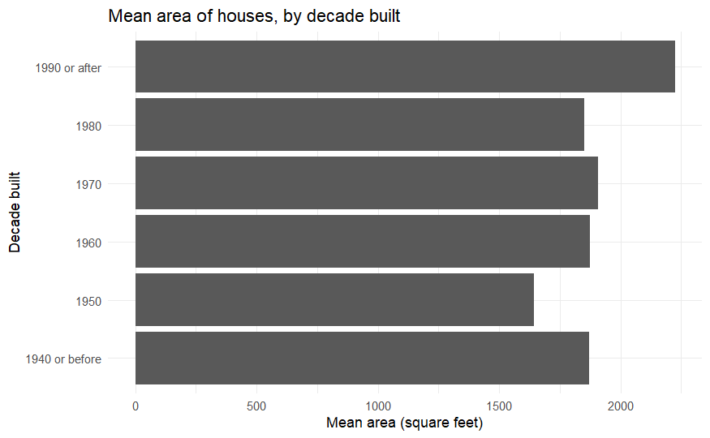

### 3.3. Visualizing the data as a dot plot

The bar chart violates the data-ink ratio principle. The bars are not necessary to convey the information. We can use a **dot plot** instead. The dot plot is a variation of the bar chart, where the bars are replaced by dots. The dot plot is a (potentially) better choice because it uses less ink to convey the same information.

```R
ggplot(
  data = mean_area_decade,
  mapping = aes(x = mean_area, y = decade_built_cat)
) +
  geom_point(size = 4) +
  labs(
    x = "Mean area (square feet)", y = "Decade built",
    title = "Mean area of houses, by decade built"
  )
```

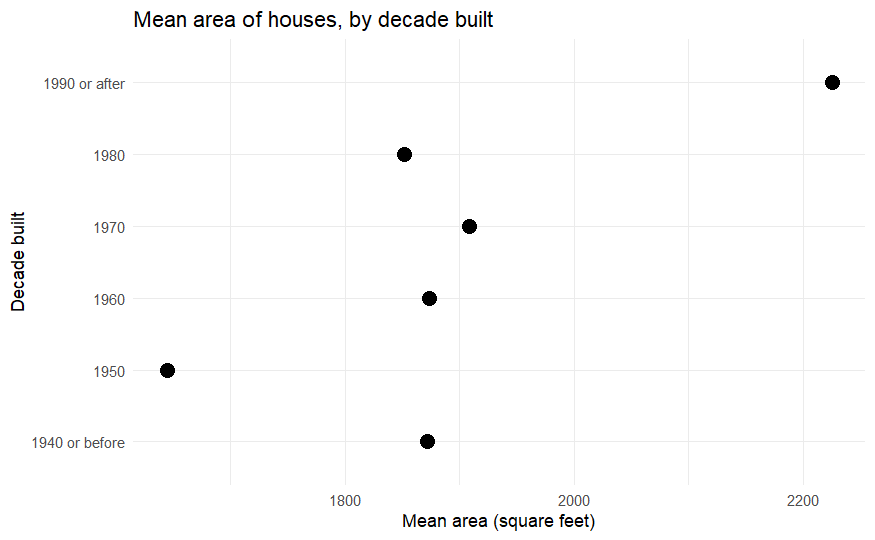