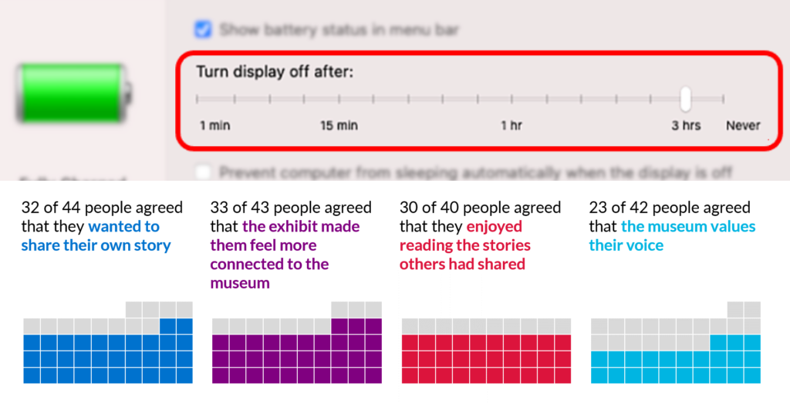
# COMP4010/5120 - Week 4 Application Exercises
---

# A. Application Exercises
Data source: https://github.com/imdevskp/covid_19_jhu_data_web_scrap_and_cleaning

## Task 1. COVID-19 `TotalCases` vs. `TotalDeaths`
From `worldometer_data.csv`, create a plot of `TotalCases` vs. `TotalDeaths`. Describe the relationship between the two variables.

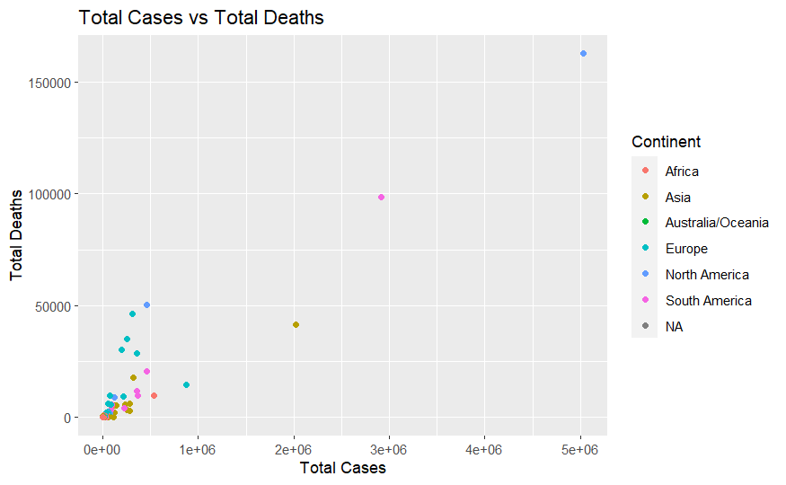

## Task 2. Log scale
Apply log scales to the plot for better '*readability*'. For these two variables, is the log scale beneficial for visualization? Briefly describe your opinion of the plot before and after applying the log scale.

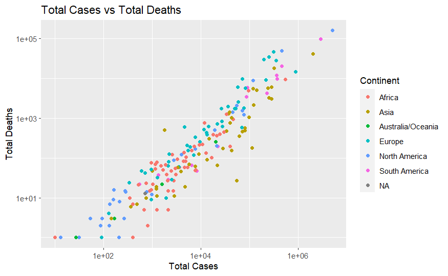

## Task 3. Using `ggwaffle`
Refer to Section B.3.2. for information on how to install and use `ggwaffle` to create waffle charts. Use `ggwaffle` to create a waffle chart to demonstrate the distribution of continents in `worldometer_data.csv` from the `Continent` column. What information does this plot tell you about the continents?

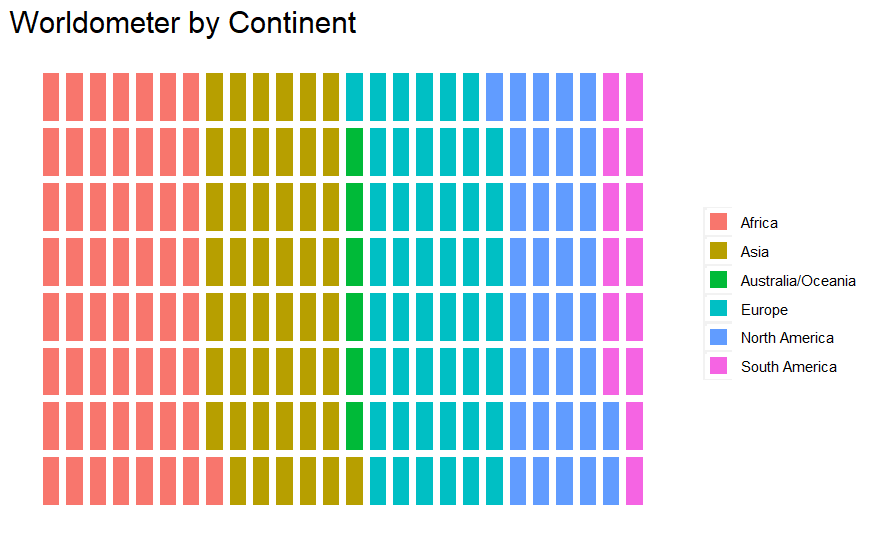

## Task 4. Tidying the waffle plot
Adjust the waffle chart to use a fixed aspect ratio so the symbols are squares.

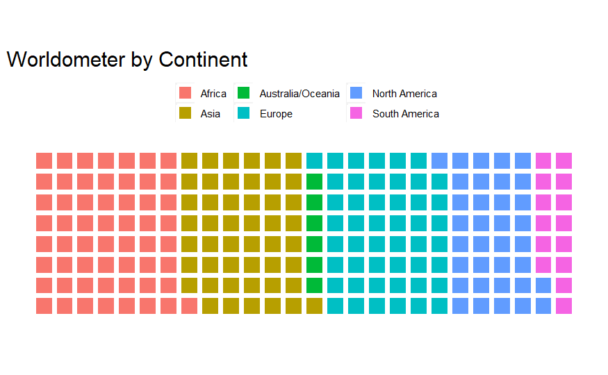

## Task 5. Coloring the plot
Use [`scale_fill_viridis_d(option='scale_name')`](https://sjspielman.git-hub.io/introverse/articles/color_fill_scales.html) to color your plot. Be sure to have `tidyverse` loaded.

EDIT: [New link](https://sjspielman.github.io/introverse/articles/color_fill_scales.html)


## Task 6. Using icons
Install the `emojifont` package with `install.packages("emojifont")` and import it. Use [`fontawesome`](https://cran.r-project.org/web/packages/emojifont/vignettes/emojifont.html#font-awesome) to get an icon/emoji and apply it to the waffle chart similar to the last example from [`ggwaffle doc`](https://liamgilbey.github.io/ggwaffle/).


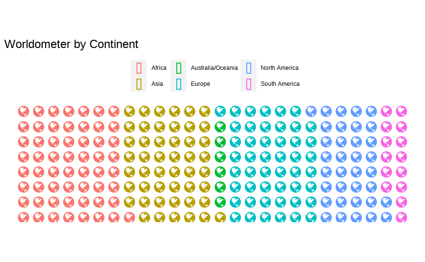

---

# B. Reading Material

## 1. Hall of Shame

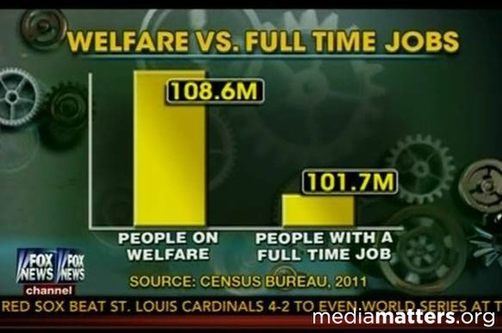

Infamous for its overuse in politics, the truncated y-axis is a classic way to visually mislead. Take a look at the graph above, comparing people with jobs to people on welfare. At first glance, the visual dynamics of the graph suggest people on welfare to number four times as many as people with jobs. Numbers don’t lie, however, and when analyzed, they point out much less sensational facts than the data visualization would suggest.  

This type of misinformation occurs when the graph’s producers ignore convention and manipulate the y-axis. The conventional way of organizing the y-axis is to start at 0 and then go up to the highest data point in your set. By not setting the origin of the y-axis at zero, small differences become hyperbolic and therefore play more on people’s prejudices rather than their rationality. 
Focus on creating your data visualizations using data with a zero-baseline y-axis and watch out for truncated axes. Sometimes these distortions are done on purpose to mislead readers, but other times they’re just the consequence of not knowing how an unintentional use of a non-zero-baseline can skew data.

## 2. Understanding and Applying Logarithmic Scales in Data Visualization

The 2 following articles provide a very nice and intuitive explanation for log scales and its benefits and use cases:
- [data-viz-workshop-2021 - Plotting using logarithmic scales](https://badriadhikari.github.io/data-viz-workshop-2021/log/)
- [The Power of Logarithmic Scale](https://dataclaritycorp.com/the-power-of-logarithmic-scale/)

Data visualization is a crucial aspect of interpreting complex datasets, and understanding different types of scales, including logarithmic scales, is vital. This tutorial aims to provide a clear understanding of logarithmic scales and their application in data visualization, helping you to make informed choices when displaying data.

### 2.1. Grasping the Concept of Log Scales

Consider the 'turn-off display after' setting in electronic devices, where options increase from minutes to hours unevenly. This intuitive understanding of varying increments is at the core of log scales.

**Visualizing distances**: A linear scale might not effectively compare distances from a central point to various cities if one distance is significantly greater than the others. Using a log scale in this scenario makes the comparison more balanced and informative.

**Transforming Data for Better Interpretation**: With exponential data like population growth or pandemic spread, linear scales can be misleading. Log scales provide a more nuanced view, revealing trends and patterns that might be obscured on a linear scale.
Exponential variables, such as wildfire spread or population growth, demonstrate rapid increases. These can be more accurately represented on a log scale, making it easier to understand their progression.

### 2.2. When to Use Logarithmic Scales

**Exponential Data**: In cases of exponential growth or decay, where data increases or decreases rapidly, log scales can transform skewed distributions into more interpretable forms.
Understanding the exponential equation (f(x) = ab^x) helps in recognizing scenarios where log scales are appropriate. Remember, log scales are less suitable for data that includes negative or zero values.

**Comparing Rates of Change**: In scenarios like tracking stock prices or disease spread, log scales can highlight rates of change more effectively than linear scales. They provide a clearer view of how variables are evolving over time, especially when the changes are multiplicative rather than additive.

**Resolving Skewness in Data Visualization**: When certain data points dominate because of their large magnitude, log scales can prevent this skewness, allowing for a more balanced view of all data points.

### 2.3. How to Read and Interpret Logarithmic Scales

**Identifying Logarithmic Scales**: Determine whether the graph is a semi-log (one axis is logarithmic) or log-log (both axes are logarithmic). Unevenly spaced grid lines are a hallmark of logarithmic scales.
Understand the representation of values on a log scale: consistent multiplicative increases rather than additive ones. For instance, each tick mark could represent a tenfold increase.

**Understanding Exponential Trends on Log Scales**: On a log scale, exponential trends appear as straight lines. This property can be used to identify exponential relationships within data and to compare different exponential trends.

### 2.4. Application in Scientific Research

**Innate Understanding of Logarithmic Representation**: Studies suggest that humans may intuitively understand logarithmic scales, as they often perceive quantities in relative terms rather than absolute differences.
This innate perception applies to various sensory experiences, such as brightness or sound, indicating the natural fit of log scales in representing certain types of data.

**Interpreting Scientific Data**: In fields where data spans several orders of magnitude, such as in astronomy or microbiology, logarithmic scales are indispensable for meaningful visualization and comparison.

### To sum it up: 

Use logarithmic scales when dealing with multiplicative changes, exponential growth or decay, and data spanning several orders of magnitude. Avoid logarithmic scales for data that includes negative values, zeroes, or when linear relationships are more appropriate. Remember, the choice of scale can significantly affect the interpretation of data. By understanding and applying logarithmic scales appropriately, you can uncover patterns and insights that might otherwise remain hidden in your data visualizations.

## 3. Waffle charts (yum!)

Waffle charts are an innovative way to visualize data, offering a unique and engaging alternative to traditional pie or bar charts. They are particularly effective for displaying part-to-whole relationships and for making comparisons between categories. This tutorial will guide you through the fundamentals of waffle charts, their construction, and their effective use in data visualization.

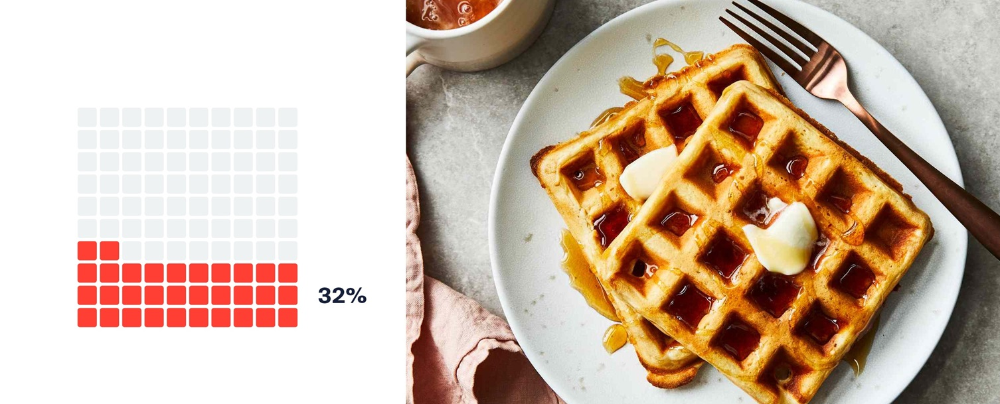

### 3.1. Understanding Waffle Charts

**What is a Waffle Chart?**  A waffle chart is a grid-based visual representation where each cell in the grid represents a small, equal portion of the whole. It’s akin to a square pie chart but offers a more granular view.
Ideal for representing percentages or proportions, waffle charts can effectively communicate data in a more relatable and visually appealing way.

**Comparative Strengths and Weaknesses**:

- Strengths: Waffle charts are excellent for illustrating small differences, which might be overlooked in pie charts. They are visually engaging and easy to interpret.
- Weaknesses: Not suitable for large datasets or for displaying changes over time. They can become cluttered and less effective if too many categories are included.

### 3.2. Creating a Waffle Chart in R using `ggwaffle`:

Waffle charts can be effectively created in R using the `ggwaffle` package, which is part of the `ggplot2` ecosystem. This package simplifies the process of creating waffle charts while providing flexibility to customize the charts. 

Install and import the `ggwaffle` package:

```R
devtools::install_github("liamgilbey/ggwaffle")
library(ggwaffle)
```

From [https://liamgilbey.github.io/ggwaffle/](https://liamgilbey.github.io/ggwaffle/):

> `ggwaffle` heavily relies on the usage of `ggplot2`. Much like standard `ggplot` graphs, waffle charts are created by adding layers to a base graphic. Because of the inner mechanisms of `ggplot2`, some of the necessary data transformations have to be completed outside of a standard plot creation. The function `waffle_iron` has been added to help with issue. 
> `ggwaffle` also introduces a column mapping function, `aes_d`. At this stage I have no idea of how useful this is outside the context of the package, but it seemed a nice way to specify dynamic column renaming. `aes_d` is obviously coined from ggplot’s aes function and has a very similar idea. Here we are mapping column names to feed into a function so they can be renamed for used appropriately.

```R
waffle_data <- waffle_iron(mpg, aes_d(group = class))

ggplot(waffle_data, aes(x, y, fill = group)) + 
  geom_waffle()
```

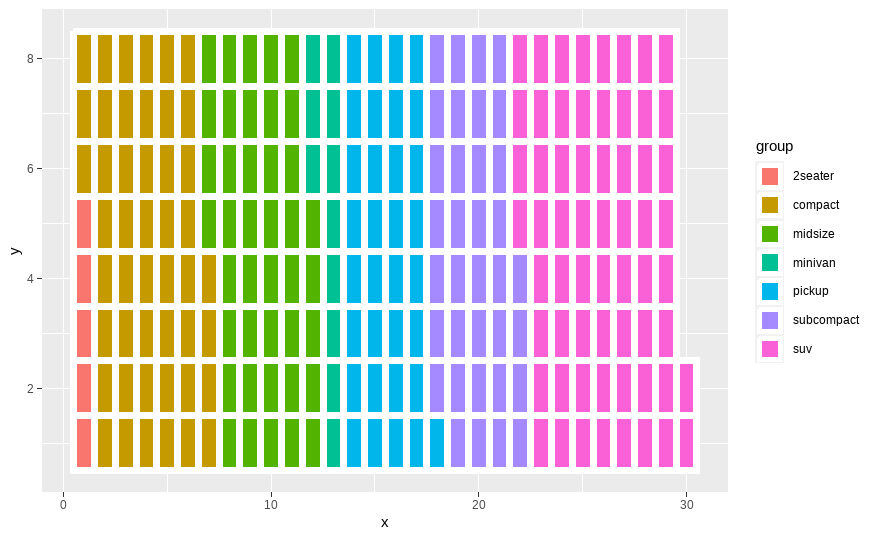

In short, you first need to prepare the data with `waffle_iron()` and then plotting it with `ggplot2` and `geom_waffle()`. See the [documentation for [`waffle_iron()`](https://rdrr.io/github/liamgilbey/ggwaffle/man/waffle_iron.html) for more details.

Let's practice with the `mtcars` dataset. Let's create a waffle chart grouped by the number of cylinders in a car. Note that `x` and `y` here are columns that were automatically created by `waffle_iron()` based on the grouping that we have requested.

```R
cyl_data <- waffle_iron(mtcars, aes_d(group = cyl))

# Creating the waffle chart
ggplot(cyl_data, mapping = aes(x, y, fill = group)) + 
  geom_waffle() + 
  ggtitle("Distribution of Cars by Cylinder Count in mtcars Dataset")
```

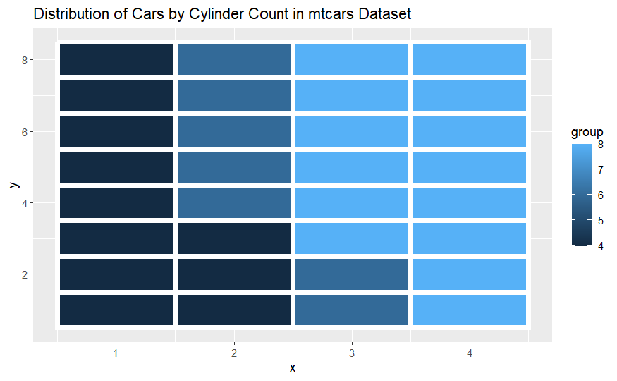

Right now it's treating our `cyl` column as a continuous nuemrical variable, but we want to treat the number of cylinders as discrete categories. Let's convert it to discrete factors and see what will happen.

```R
cyl_data <- waffle_iron(mtcars, aes_d(group = cyl))

# Creating the waffle chart
ggplot(cyl_data, mapping = aes(x, y, fill = as.factor(group))) + 
  geom_waffle() + 
  ggtitle("Distribution of Cars by Cylinder Count in mtcars Dataset")
```

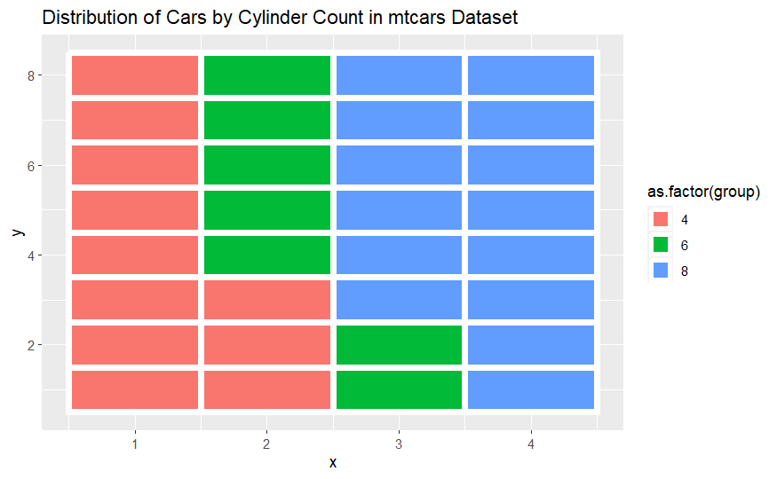

Much better! Let's change the theme to the default waffle theme so it looks more like a proper waffle chart.

```R
cyl_data <- waffle_iron(mtcars, aes_d(group = cyl))

# Creating the waffle chart
ggplot(cyl_data, mapping = aes(x, y, fill = as.factor(group))) + 
  geom_waffle() + 
  theme_waffle() +
  ggtitle("Distribution of Cars by Cylinder Count in mtcars Dataset")
```

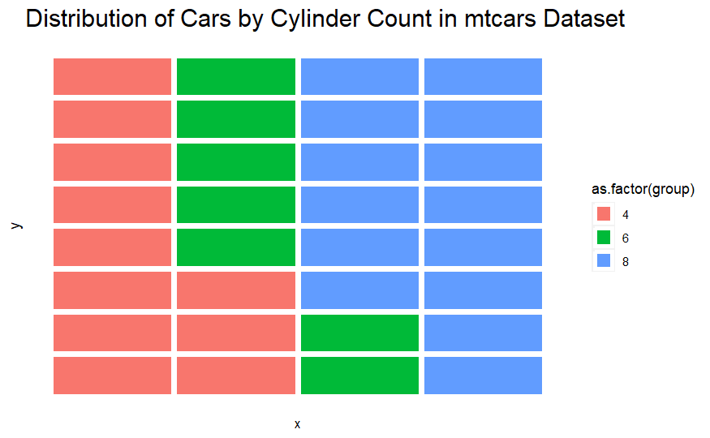

For more customization, please refer to this handy [quick start documentation for `ggwaffle`](https://liamgilbey.github.io/ggwaffle/).

### 3.3. Best Practices for Clarity and Accuracy:

- **Keep it simple**: Limit the number of categories to ensure the chart is easy to read and interpret.
- **Consistent scale**: Ensure that each cell represents the same value across all categories for accurate comparison.
- **Use color effectively**: Choose distinct, contrasting colors for different categories to enhance readability.
- **Labels**: Include clear labels and a legend to convey the meaning of each color and category. This enhances the user's understanding of the chart. If necessary, include annotations or tooltips for more detailed explanations.
- **Interactivity**: In digital formats, make your waffle charts interactive. Hover-over effects can display exact values or additional information, adding depth to the data presented.

### 3.4. Use cases

Specific examples: 
- Displaying election results, survey data, or market share.
- Comparing demographic data like age or income distribution.
- Visualizing progress towards a goal, like fundraising or project milestones.

### To sum it up: 

Waffle charts are ideal when you want to emphasize the composition of a dataset and when dealing with a limited number of categories.
Consider the nature of your data, the audience, and the context of your presentation before deciding if a waffle chart is the most effective tool for your visualization needs.
Waffle charts, with their straightforward design and ease of interpretation, can be a powerful tool in your data visualization arsenal. By applying the principles outlined in this tutorial, you can enhance your presentations and make complex data more accessible and engaging for your audience.
