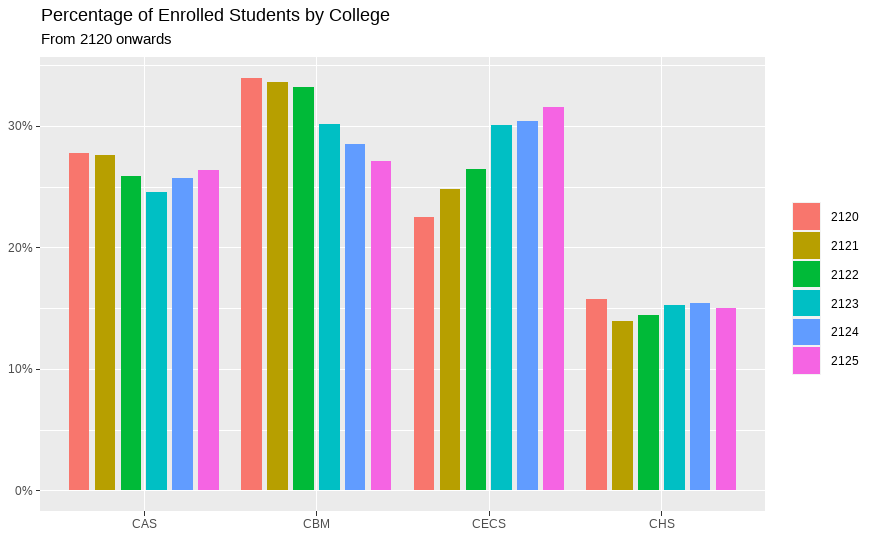
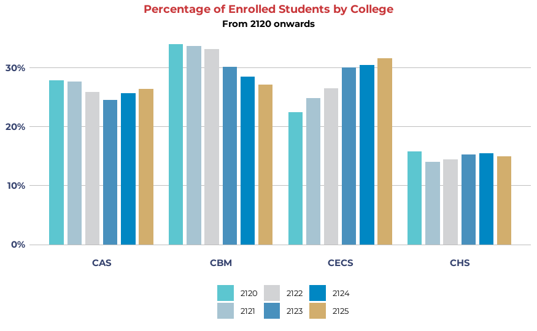
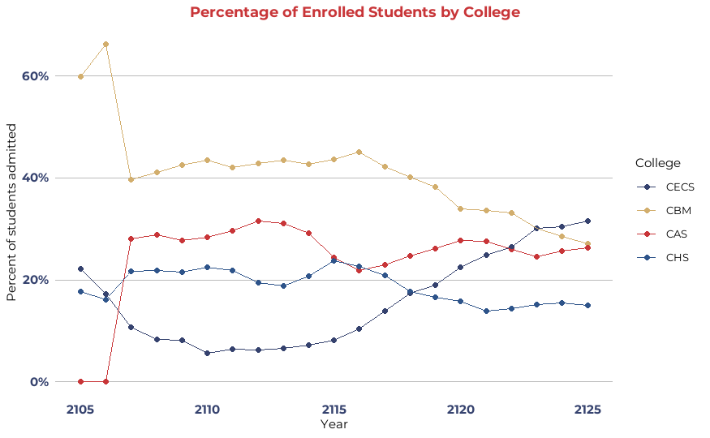
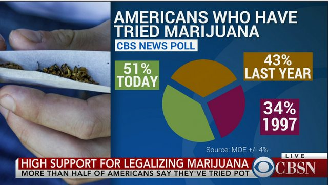

# COMP4010/5120 - Week 5 Application Exercises
---

# A. Application Exercises
Suppose we have a fictional dataset of enrolment at VinUni from the year 2105 to 2125. We are tasked to create a series of statistical charts to be presented on the organization's official media streams. Due to [**organizational branding**](https://www.paradigmmarketinganddesign.com/what-is-organizational-branding/) requirements, we have to design our charts to follow the required visual language of the organization.

> Organizational branding is one of the most often misunderstood concepts in marketing and design. Many make the mistake of relegating it to simply the logo or signature colors of a business or organization. But a brand is so much more than that. It is one of, if not the most valuable asset you possess. While it is not always easily defined, it is almost always easily recognized. It is how your audience perceives you and is created by a combination of your reputation, identity, and voice. In other words, organizational branding is the mechanism used to shape, cultivate, and evolve your brand. It involves many elements, including your name, logo, tagline, website, colors, collateral, messaging, positioning, graphic elements, social media, and other outreach platforms." - [What is Organizational Branding?](https://www.paradigmmarketinganddesign.com/what-is-organizational-branding/)

VinUni, for instance, has comprehensive[ brand identity guidelines](https://policy.vinuni.edu.vn/all-policies/brand-identity-manual/). Their design center offers clear instructions on using the VinUni logo, color scheme, and fonts, along with downloadable resources like a PowerPoint template.

Let's say you want to develop a set of statistical charts for a VinUni presentation in a specific course, and you want to ensure they are both consistent with the university's branding and can be easily replicated. You can use the `ggplot2` package to create a custom theme that aligns with VinUni's brand identity.

## Task 1. Simple dodged bar chart for enrolment by college

From `college_data_normalized.csv`, create a dodged bar chart of `pct` for each `college` with fill by `year`. Only show data from 2120 onwards.



## Task 2. Customize with brand identity

With the [`showtext`](https://cran.rstudio.com/web/packages/showtext/vignettes/introduction.html) library (`install.packages('showtext')`) and the [`ggplot2` theme documentation](https://ggplot2.tidyverse.org/reference/theme.html), customize the chart with corresponding fonts and color schemes.

You can select any organization branding scheme that you may like, the following examples will be following VinUni's branding.



## Task 3. Make customization reusable by creating a function

Create an R function for your customizations which can be reused for future charts. For example, with the base chart:
`college_plot <- ggplot(...)`, and a function called `theme_vinuni`, we can simply apply the theme to the chart by doing:

```R
college_plot + 
  theme_vinuni()
```

Create the same plot as Task 2, but using a function to apply your theme. **Note**: You don't need to include the color palette in your function. That can be done outside of the function using `scale_fill_manual` or `scale_color_manual`.

## Task 4. Create a themed multiple line graph

Create a multiple line graph that shows the percentage of enrolled students for each college from 2105 to 2125, apply the theme you have previously created. Experiment with the color palette, pick any color that you want which may represent the brand you have chosen for effective visualization.




---

# B. Reading Material

## 1. Hall of Shame



>The pie chart in the above image shows the percentage of Americans who have tried marijuana in three different years. Now, a pie chart is used to show percentages of a whole and represents percentages at a set point in time. Due to this, the audience may mistake the visualization showing the following information. 
> - All the people participating in the survey tried marijuana. 
> - 51 percent of the population tried marijuana today.
> - 43 percent of them tried it last year.
> - 34 percent of them tried marijuana in 1997. 
> However, the reality is entirely different. The above pie chart shows data from three different surveys. The graph is trying to show that 
> - Today, 51 percent of the total population has tried marijuana. 49 percent of them haven’t.
> - Last year, 43 percent of the total population tried marijuana. 57 percent of them didn’t.
> - In 1997, only 34 percent of the total population tried marijuana. 67 percent of them didn’t.
> Thus, the above data visualization is using graphic forms in inappropriate ways to distort the data.

Source: [Codeconquest](https://www.codeconquest.com/blog/12-bad-data-visualization-examples-explained/)

## 2. Customizing `ggplot2`

This week, we will delve into customizing themes in `ggplot2`, an R package widely used for creating elegant data visualizations. Specifically, we will focus on how to recreate a specific plot with customized themes. The customization involves font adjustments using the showtext package and applying unique color palettes based on different branding guidelines.

### Step 1: Setting Up the Font

Select a font according to your chosen branding scheme. For VinUni, it's the Montserrat type face. We will use the Montserrat font for our plot, a versatile and modern sans-serif typeface. To do this, we first need to load the `showtext library` and add the Montserrat font.

```R
library(showtext)
font_add_google("Montserrat", "Montserrat")
showtext_auto() 
```

### Step 2: Defining Color Palettes

Our customization involves two color palettes based on branding guidelines from VinUni. Let's define these palettes in R:

```R
# VinUni color palette
vinuni_palette_main <- c("#35426e", "#d2ae6d", "#c83538", "#2e548a")
vinuni_palette_accents <- c("#5cc6d0", "#a7c4d2", "#d2d3d5",  "#4890bd", "#0087c3", "#d2ae6d")
```

### Step 3: Creating the Plot with Custom Themes

Assuming you have a plot object named `my_plot`, we can customize its theme as follows:

```R
main_font = "Montserrat"

college_plot +
  scale_fill_manual(values = vinuni_palette_accents) +
  theme_minimal(
    base_family = main_font,
    base_size = 11
  ) +
  theme(
    plot.title.position = "plot",
    plot.title = element_text(hjust = 0.5, face="bold", colour = vinuni_palette_main[3]),
    plot.subtitle = element_text(hjust = 0.5, face="bold"),
    legend.position = "bottom",
    panel.grid.major.x = element_blank(),
    panel.grid.minor.x = element_blank(),
    panel.grid.major.y = element_line(color = "grey", linewidth = 0.2),
    panel.grid.minor.y = element_blank(),
    axis.text = element_text(size = rel(1.0)),
    axis.text.x = element_text(face="bold", colour = vinuni_palette_main[1]), 
    axis.text.y = element_text(face="bold", colour = vinuni_palette_main[1]), 
    legend.text = element_text(size = rel(0.9))
  )
```

### Step 4: Finalizing the Plot

Finally, to ensure the `showtext` settings are applied correctly, we need to call `showtext_auto()` again at the end of the script.