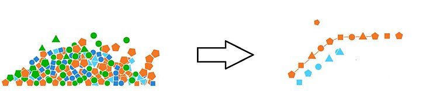
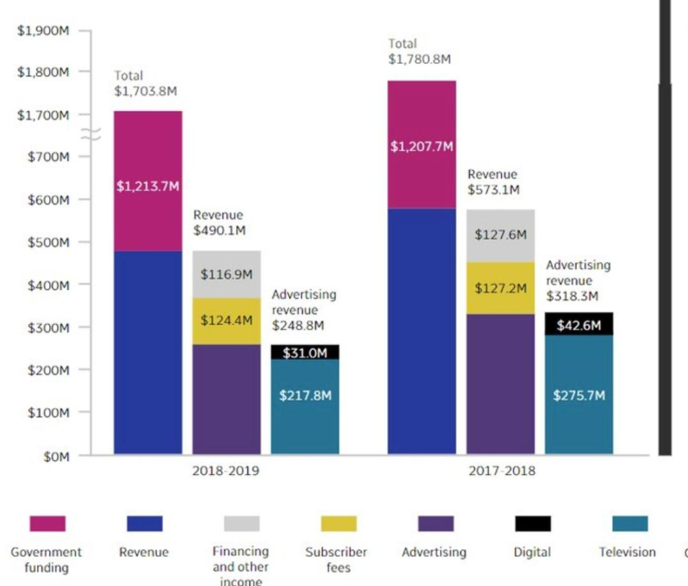

# COMP4010/5120 - Week 6 Application Exercises
---

# A. Application Exercises

**Data:** [`instructional-staff.csv`](instructional-staff.csv)

The American Association of University Professors (AAUP) is a nonprofit membership association of faculty and other academic professionals. [This report](https://www.aaup.org/sites/default/files/files/AAUP_Report_InstrStaff-75-11_apr2013.pdf) by the AAUP shows trends in instructional staff employees between 1975 and 2011, and contains an image very similar to the one given below.


Each row in this dataset represents a faculty type, and the columns are the years for which we have data. The values are percentage of hires of that type of faculty for each year.

In order to recreate this visualization we need to first reshape the data to have one variable for faculty type and one variable for year. In other words, we will convert the data from the long format to wide format.

## Task 1. Recreate the visualization

Reshape the data so we have one row per faculty type and year, and the percentage of hires as a single column.

## Task 2. Attempt to recreate the original bar chart as best as you can. 

Don’t worry about theming or color palettes right now. The most important aspects to incorporate:

- Faculty type on the y-axis with bar segments color-coded based on the year of the survey
- Percentage of instructional staff employees on the x-axis
- Begin the x-axis at 5%
- Label the x-axis at 5% increments
- Match the order of the legend

> [forcats](https://forcats.tidyverse.org/) contains many functions for defining and adjusting the order of levels for factor variables. Factors are often used to enforce specific ordering of categorical variables in charts.

## Task 3. Let’s make it better

The original plot is not very informative. It’s hard to compare the trends for across each faculty type.

Improve the chart by using a relative frequency bar chart with year on the y-axis and faculty type encoded using color.

What are this chart’s advantages and disadvantages? 

## Task 4: Let’s instead use a line chart. 

Graph the data with year on the x-axis and percentage of employees on the y-axis. Distinguish each faculty type using an appropriate aesthetic mapping.

## Task 5: Cleaning it up

- Add a proper title and labelling to the chart
- Use an optimized color palette
- Order the legend values by the final value of the percentage variable

## Task 6: More improvements!

Colleges and universities have come to rely more heavily on non-tenure track faculty members over time, in particular part-time faculty (e.g. contingent faculty, adjuncts). We want to show how academia is increasingly relying on part-time faculty.

With your peers, sketch/design a chart that highlights the trend for part-time faculty. What type of geom would you use? What elements would you include? What would you remove?

Create the chart you designed above using `ggplot2`.

# B. Reading Material

## 1. Hall of Shame



>At first glance, the chart might seem okay. However, there are plenty of problems with it. 
> The Y-axis of the graph has a break in it. The lower ticks at the Y-axis are separated at \$100M. After \$700M, It suddenly jumps from \$700M to \$1,700M. Due to this, the revenue of \$490M looks bigger than \$1213M of government funding. Hence, it’s extremely misleading to present the scale in a way where 1.2 billion looks smaller than or almost equal to 490 million. 
> At first glance, a viewer will figure out that television revenue is the same as government funding. This is due to the fact that the blue part of the bar chart is almost equal to the length of the pink part of the bar chart due to the distortion of the Y-axis labels.
> Another major problem in the above chart is that the Revenue and advertising revenue charts should not be separate from the main bar showing total income. They aren’t two separate bars but they are just subdividing the revenue section of the bar showing the total income. The second bar is just showing how the blue part of the first bar is split and the third one is showing how the purple part of the second bar chart is split.
> Thus, we can say that the above chart is an example of bad data visualization as it is intentionally misleading the viewer by distorting the elements of the chart.
[[Source]](https://www.codeconquest.com/blog/12-bad-data-visualization-examples-explained/)

## 2. Wide data vs. long data formats

In data analysis, the terms "*wide*" and "*long*" refer to two different ways of structuring a dataset, especially in the context of handling repeated measures or time series data. Understanding these formats is crucial for data manipulation, visualization, and analysis. Let's define each:

**Wide Format**:

- **Characteristic**: In a wide format, each subject or entity is usually in a single row, with multiple columns representing different variables, conditions, time points, or measurements.
- **Example**: Consider a dataset of students with their scores in different subjects. Each student would have a single row, with separate columns for each subject (like Math, Science, English).

| StudentID | MathScore | ScienceScore | EnglishScore |
|-----------|-----------|--------------|--------------|
| 1         | 85        | 90           | 75           |
| 2         | 88        | 92           | 80           |
| 3         | 90        | 94           | 85           |

- **Use Case**: The wide format is more intuitive for human reading and is often the format in which data is initially collected. It's well-suited for scenarios where each column represents a distinct category.

**Long Format**:

- **Characteristic**: In the long format, each row represents a single observation, often a single time point or condition per subject. There are typically columns indicating the subject/entity, the variable (or time/condition), and the value.
- **Example**: Using the same student dataset, a long format would list each subject's score in a separate row.
  
| StudentID | Subject  | Score |
|-----------|----------|-------|
| 1         | Math     | 85    |
| 1         | Science  | 90    |
| 1         | English  | 75    |
| 2         | Math     | 88    |
| 2         | Science  | 92    |
| 2         | English  | 80    |
| 3         | Math     | 90    |
| 3         | Science  | 94    |
| 3         | English  | 85    |

- **Use Case**: The long format is particularly useful for statistical analysis and visualization in many data analysis tools, as it allows for more consistent treatment of variables. It's also the preferred format for many types of time series or repeated measures data analysis.

Essentially, the wide format is more about having separate columns for different variables, while the long format focuses on having one row per observation, making it easier to apply certain types of data manipulations and analyses. The choice between wide and long formats depends on the specific requirements of your analysis and the tools you are using.

## 3. Turning Wide Data into Long Format and Vice Versa in `R`

In the `tidyverse` package in R, you can use different functions to transform data between wide and long formats. The `tidyr` package, part of the `tidyverse`, provides convenient functions for these transformations: `pivot_longer()` for turning wide data into long format, and `pivot_wider()` for the reverse.

Let's assume you have a wide data frame named `wide_data`:

```R
wide_data <- tibble(
  id = 1:3,
  score_math = c(90, 85, 88),
  score_science = c(92, 89, 87),
  score_english = c(93, 90, 85)
)
```

To convert this into a long format, you'd use `pivot_longer()`:

```R
library(tidyverse)

long_data <- wide_data %>% 
  pivot_longer(
    cols = starts_with("score"), 
    names_to = "subject", 
    names_prefix = "score_", 
    values_to = "score"
  )
```

In this example, `cols = starts_with("score")` selects all columns that start with `"score"` to be transformed. `names_to = "subject"` creates a new column named `"subject"` for the former column names. `names_prefix = "score_"` removes the prefix `"score_"` from these names. Finally, `values_to = "score"` specifies that the actual values go into a column named `"score"`.

Let's look at the reverse process. Assuming you have a long format data frame `long_data`:

```R
long_data <- tibble(
  id = rep(1:3, each = 3),
  subject = rep(c("math", "science", "english"), times = 3),
  score = c(90, 92, 93, 85, 89, 90, 88, 87, 85)
)
```

To convert this into a wide format, use `pivot_wider()`:

```R
wide_data <- long_data %>% 
  pivot_wider(
    names_from = subject, 
    values_from = score,
    names_prefix = "score_"
  )
```

Here, `names_from = subject` tells the function to create new columns from the unique values in the `"subject"` column. `values_from = score` indicates that the values in these new columns should come from the `"score"` column. `names_prefix = "score_"` adds a prefix to the new column names for clarity.

Both `pivot_longer()` and `pivot_wider()` are highly versatile and can be customized further to accommodate more complex data reshaping tasks.


## 4. Data manipulation with `mutate()`, `fct_reorder()`, and `if_else()`

### 4.1. `mutate()`

`mutate` is used in `dplyr` to create new columns or modify existing ones in a data frame or tibble. It's a key function for data transformation.

With `mutate`, you can apply a function to one or more existing columns to create a new column, or you can overwrite an existing column with new values.

For example:

```R
library(dplyr)

data <- tibble(
  x = 1:5,
  y = c("A", "B", "A", "B", "C")
)

data <- data %>% 
  mutate(z = x * 2) # Creates a new column 'z' which is twice the value of 'x'
```

### 4.2. `fct_reorder()`

`fct_reorder()` is from the `forcats` package, which is designed for handling factors (categorical data) in `R`. `fct_reorder` reorders factor levels based on the values of another variable, which is particularly useful for plotting.

This function is typically used when you want the levels of a factor to be ordered based on some quantitative measure. This is often done before creating plots to ensure that factor levels are displayed in a meaningful order.

Example:

```R
library(forcats)

data <- tibble(
  category = factor(c("A", "B", "A", "B", "C")),
  value = c(3, 5, 2, 4, 1)
)

data <- data %>%
  mutate(category = fct_reorder(category, value, .fun = mean)) 
# Reorders 'category' based on the mean of 'value' for each level
```

In this example, `fct_reorder` is used inside `mutate` to reorder the levels of the category factor based on the mean of the corresponding values. 

### 4.3. `if_else()`

`if_else` is another function from the `dplyr` package in `R`, which is used for conditional logic. It is similar to the base `R` `ifelse` function but is more strict and type-safe. `if_else` tests a condition and returns one value if the condition is true and another if it is false.

Let's combine `mutate()`, `fct_reorder()`, and `if_else()` in examples to illustrate their usage:


**Example 1: Using `mutate()` with `if_else()`**
Imagine a dataset of employees with their sales numbers, and we want to classify them as "High Performer" or "Low Performer" based on whether their sales exceed a certain threshold:

```R
library(dplyr)

# Example dataset
employee_data <- tibble(
  employee_id = 1:5,
  sales = c(200, 150, 300, 250, 100)
)

# Classify employees based on their sales
employee_data <- employee_data %>%
  mutate(performance = if_else(sales > 200, "High Performer", "Low Performer"))
```

Here, `if_else()` is used to create a new column `performance` which classifies employees based on whether their `sales` are greater than 200.

**Example 2: Using `mutate()` with `fct_reorder()` and `if_else()`**
Now, let's combine both in a more complex scenario:

```R
# Combined dataset
data <- tibble(
  category = factor(c("A", "B", "A", "B", "C")),
  value = c(3, 15, 2, 4, 1),
  status = c("New", "Old", "Old", "New", "New")
)

# Reorder 'category' and create a new 'status_label' column
data <- data %>%
  mutate(
    category = fct_reorder(category, value, .fun = mean),
    status_label = if_else(value > 5, "High", "Low")
  )
```

In this combined example, we first reorder `category` based on the mean of `value`. Then we use `if_else` to create a new column `status_label` that assigns `"High"` or `"Low"` based on the `value` column. This showcases how `mutate()` can be used to simultaneously perform multiple transformations on a dataset.
