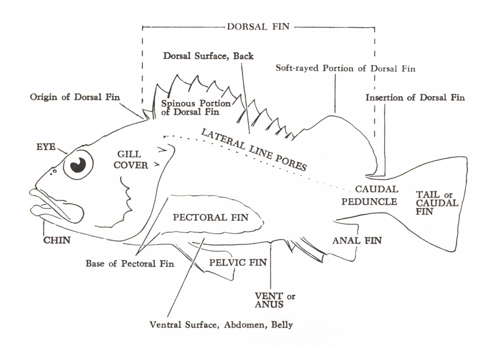
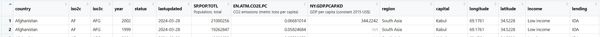
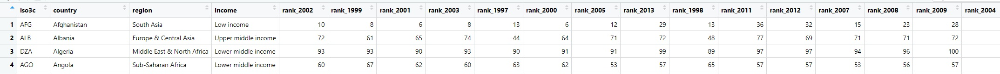
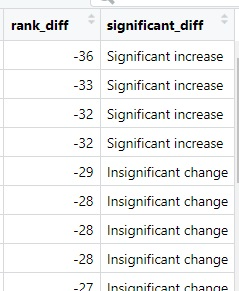
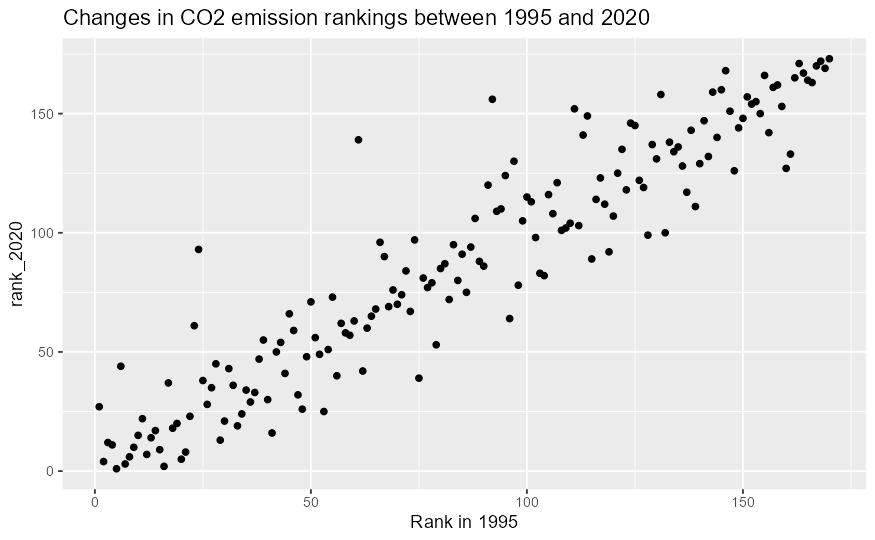
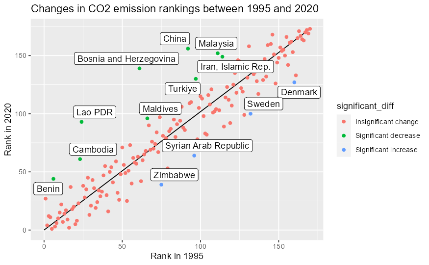
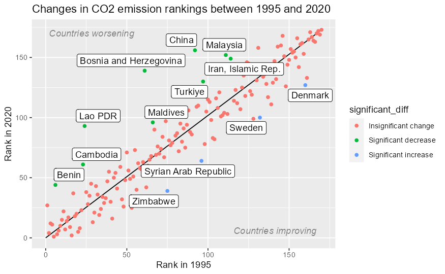
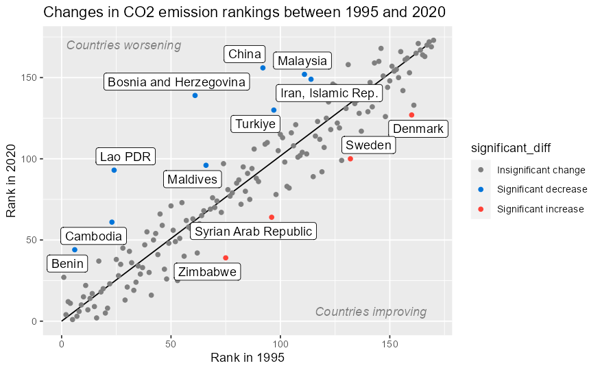
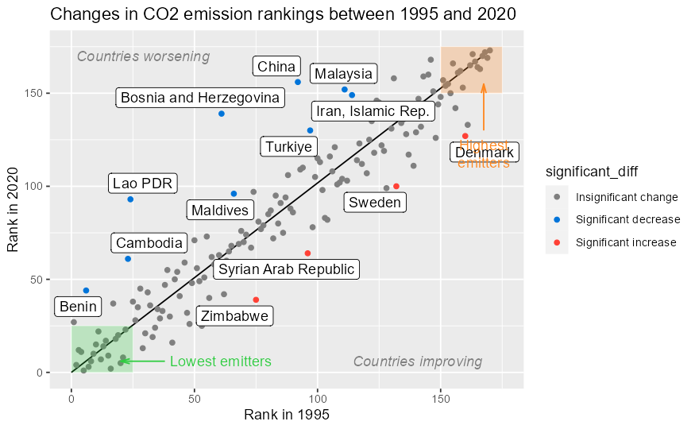

# COMP4010/5120 - Week 7 Application Exercises
---

# A. Application Exercises

**Important documentation:** [`ggplot2 annotate()`](https://ggplot2.tidyverse.org/reference/annotate.html)

**Data:** `wdi_co2_raw <- WDI(country = "all", c("SP.POP.TOTL","EN.ATM.CO2E.PC","NY.GDP.PCAP.KD"), extra = TRUE, start = 1995, end = 2023)` from the `WDI` library by World Bank.

Although this dataset contains up to 2023, the CO2 emissions data is mostly `NA` from 2021 onwards, so we will be using only rows up until 2020. Also, to reduce clutter, let's only consider countries with a population greater than 200,000.



For convenience you should rename some columns to more *usable* names:

- `SP.POP.TOTL` to `population`,
- `EN.ATM.CO2E.PC` to `co2_emissions`,
- `NY.GDP.PCAP.KD` to `gdp_per_cap`,

```R
wdi_clean <- wdi_co2_raw |>
  filter(region != "Aggregates") |>
  filter(population > 200000) |>
  select(iso2c, iso3c, country, year,
    population = SP.POP.TOTL,
    co2_emissions = EN.ATM.CO2E.PC,
    gdp_per_cap = NY.GDP.PCAP.KD,
    region, income
  )
```

Create rankings for countries by CO2 emissions by year:

```R
co2_rankings <- wdi_clean |>
  # Get rid of all the rows that have missing values in co2_emissions
  drop_na(co2_emissions) |>
  # Look at each year individually and rank countries based on their emissions that year
  mutate(
    ranking = rank(co2_emissions),
    .by = year
  )
```

## Task 1: Prepare data in wide format

Convert the data frame into wide format to better see the ranking by year.



## Task 2. Data wrangling

In this task you will need to prepare the data for further visualization tasks.

- Calculate the difference in rankings between any 2 years (e.g. 2020 and 1995) and store in a column called `rank_diff`. 
- Create a column called `significant_diff` to indicate whether the rank changed by more than 30 positions, and whether it was a significant increase or significant decrease in ranking.



## Task 3. Scatter plot for changes in CO2 emission rankings between 1995 and 2020 (or the years you've chosen)

Create a basic plot that visualizes the changes in CO2 emission rankings between 1995 and 2020 (or the years you've chosen).



# Task 4. Lazy way to show change in rank

Can you come up with the simplest visual element we can use to demonstrate whether a country increased, decreased, or maintained their ranking? You shouldn't need to change the data in any way.
Add it to your current plot. (You may need to read the [`ggplot2 annotate()`](https://rfortherestofus.com/2023/10/annotate-vs-geoms) examples).

# Task 5. Highlight significant countries

Add colors to better separate the three groups of countries based on the change in ranking. Use [`geom_label_repel()`](https://r-graph-gallery.com/package/ggrepel.html) from the `ggrepel` library to add the names of the countries which had a significant change in their rank.



# Task 6. Additional text annotations

Since our plot is showing the relationship between the ranking of two different years, it essentially divides the plot into two halves. Add text annotations to provide labels for the two halves of the plot, `"Countries improving"` and `"Countries worsening"`.



# Task 7. Using colors to redirect attention

Before we added colors to highlight the different classes of countries based on their change in ranking. Now use `scale_color_manual()` to change the color of the insignificant countries to be more *uninteresting*.



# Task 8. More geometric annotations

With `annotate()`, use `segment` (with `arrow` parameter) and `rect` to create boxes, arrows, and text labels to highlight region containing the top 25 and bottom 25 ranking countries labelled `"Lowest emitters"` and `"Highest emitters"`.



# B. Reading Material

## Hall of Fame!

A YouTuber have created a graph of all Wikipedia articles, which showcases how much information you can extract from an unfathomable amount of data.

[I Made a Graph of Wikipedia... This Is What I Found](https://www.youtube.com/watch?v=JheGL6uSF-4&ab_channel=adumb)
[](https://www.youtube.com/watch?v=JheGL6uSF-4&ab_channel=adumb)

Within the same graph, using different annotation elements (mostly highlighting), the author presented multiple interesting findings like trends, relationships, communinities, special communities, isolated articles (deadends, orphans), etc.

The video is a great example showing the power of extracting *information* from *data*, with visualization.
