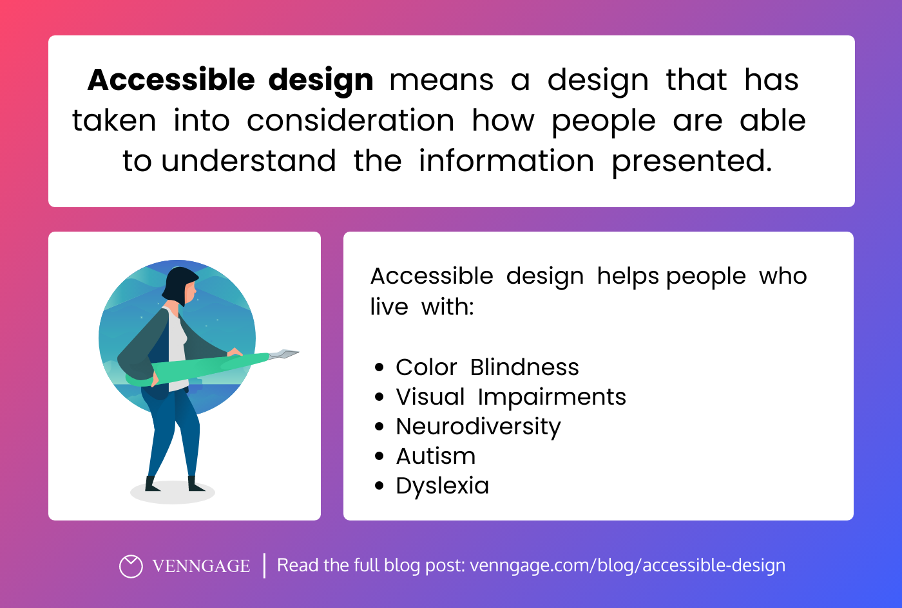
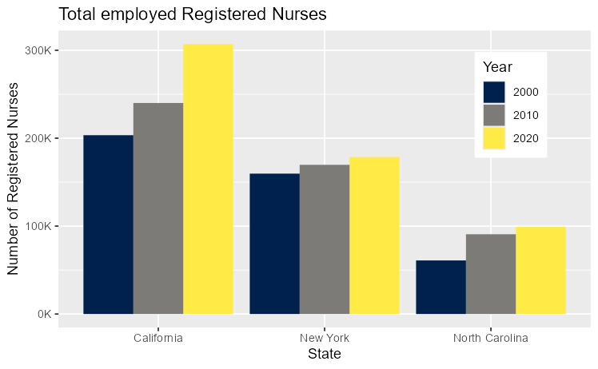
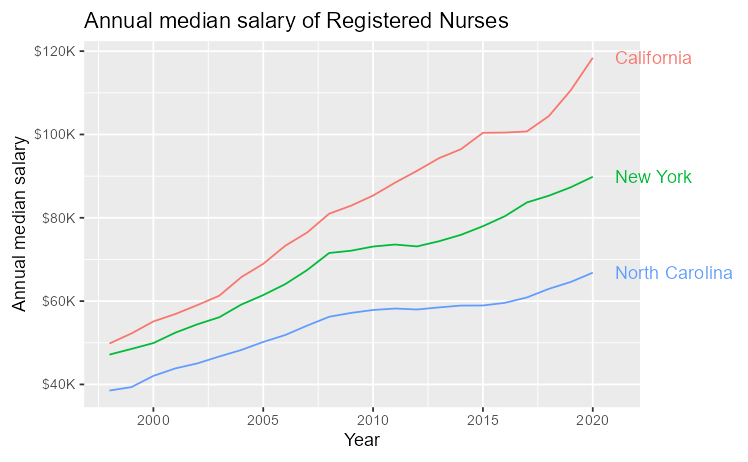
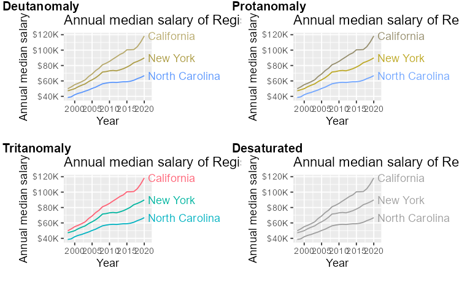
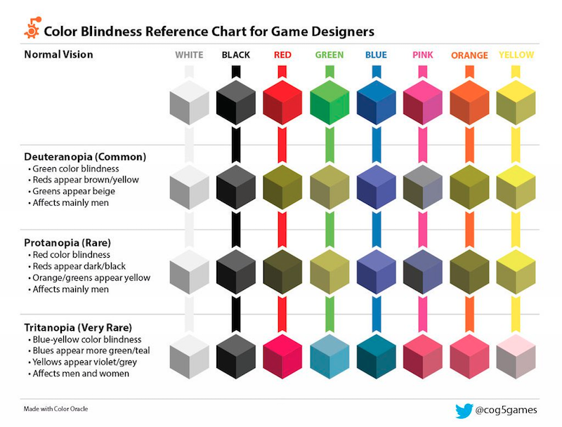
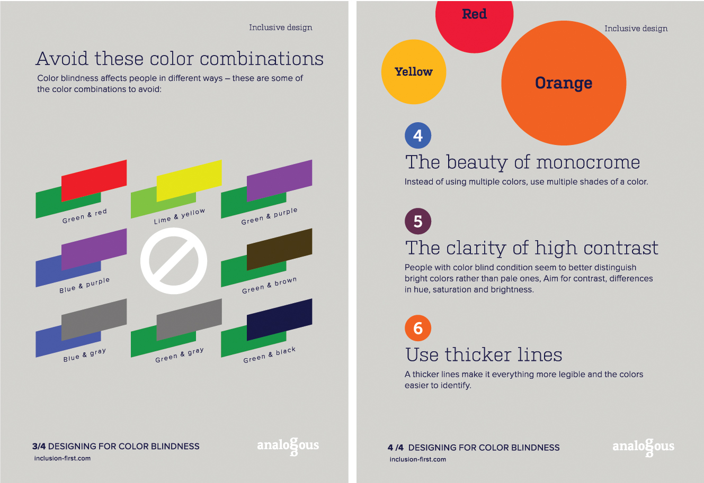
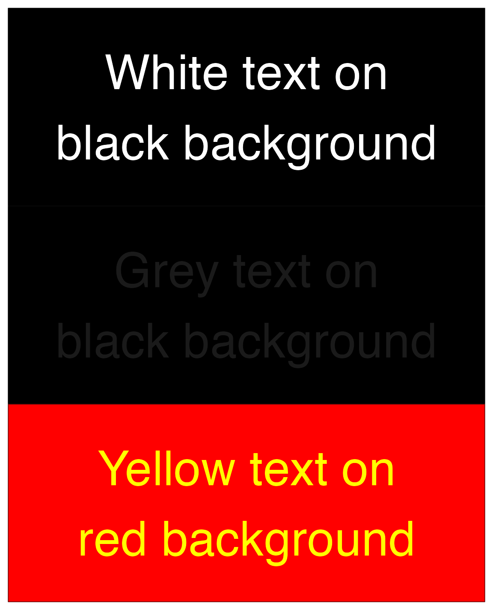

# COMP4010/5120 - Week 9 Application Exercises
---

# A. Application Exercises

**Data:** [`nurses.csv`](./nurses.csv)

```R
nurses <- read_csv("nurses.csv") |> clean_names()

# subset to three states
nurses_subset <- nurses |>
  filter(state %in% c("California", "New York", "North Carolina"))
```

The following code chunk demonstrates how to add alternative text to a bar chart. The alternative text is added to the chunk header using the `fig-alt` chunk option. The text is written in Markdown and can be as long as needed. Note that fig-cap is not the same as `fig-alt`.

```R
#| label: nurses-bar
#| fig-cap: "Total employed Registered Nurses"
#| fig-alt: "The figure is a bar chart titled 'Total employed Registered
#| Nurses' that displays the numbers of registered nurses in three states
#| (California, New York, and North Carolina) over a 20 year period, with data
#| recorded in three time points (2000, 2010, and 2020). In each state, the
#| numbers of registered nurses increase over time. The following numbers are
#| all approximate. California started off with 200K registered nurses in 2000,
#| 240K in 2010, and 300K in 2020. New York had 150K in 2000, 160K in 2010, and
#| 170K in 2020. Finally North Carolina had 60K in 2000, 90K in 2010, and 100K
#| in 2020."

nurses_subset |>
  filter(year %in% c(2000, 2010, 2020)) |>
  ggplot(aes(x = state, y = total_employed_rn, fill = factor(year))) +
  geom_col(position = "dodge") +
  scale_fill_viridis_d(option = "E") +
  scale_y_continuous(labels = label_number(scale = 1/1000, suffix = "K")) +
  labs(
    x = "State", y = "Number of Registered Nurses", fill = "Year",
    title = "Total employed Registered Nurses"
  ) +
  theme(
    legend.background = element_rect(fill = "white", color = "white"),
    legend.position = c(0.85, 0.75)
    )
```




## Task 1. Add alt text to line chart

Add appropriate alt text (label, caption, and alt text) to make the following chart accessible for screen readers.

```R
# Your label here
# Your caption here
# Your alt text here

nurses_subset |>
  ggplot(aes(x = year, y = annual_salary_median, color = state)) +
  geom_line() +
  scale_y_continuous(labels = label_dollar(scale = 1/1000, suffix = "K")) +
  labs(
    x = "Year", y = "Annual median salary", color = "State",
    title = "Annual median salary of Registered Nurses"
  ) +
  coord_cartesian(clip = "off") +
  theme(
    plot.margin = margin(0.1, 0.9, 0.1, 0.1, "in")
    )
```


## Task 2. Direct labelling instead of legends

Direct labels is when you add corresponding text annotations to a plot to describe the visual elements without relying on legends.

Create a version of the same line chart but using direct labels instead of legends. 

You can achieve this with just `geom_text()` but you can also check out https://r-graph-gallery.com/web-line-chart-with-labels-at-end-of-line.html for a fancier way of achieving this.



## Task 3. Colorblind-friendly plots

Use `colorblindr` for colorblind-friendly palettes.
```{r}
#remotes::install_github("wilkelab/cowplot")
#install.packages("colorspace", repos = "http://R-Forge.R-project.org")
#remotes::install_github("clauswilke/colorblindr")
library(colorblindr)
```

Try out colorblind simulations at http://hclwizard.org/cvdemulator/ or |> your plot to `cvd_grid()` to see the plot in various color-vision-deficiency simulations.

With the line chart from Task 1, create 3 different plots: one with the default color scale, one with the `viridis` color scale, and one with the `OkabeIto` color scale from `colorblindr`. Show the `cvd_grid()` of each plot and describe the simulated effectiveness of the color scales for colorblind viewers.

For example, the grid for the default palette should look like this.



# B. Reading Material

## 1. Accessible data visualization

Accessibility in data visualization is essential because it ensures that all individuals, regardless of disabilities or limitations, have the opportunity to understand and engage with data.

Data visualizations are powerful tools for conveying complex information quickly and effectively. Ensuring these tools are accessible means that everyone, including people with disabilities such as visual impairments, cognitive differences, or mobility restrictions, can benefit from the data being presented. This democratization of information supports equality and inclusivity.

Many regions have legal requirements, such as the Americans with Disabilities Act (ADA) in the U.S., which mandate that digital content, including data visualizations, be accessible to all users. Beyond legal compliance, there is an ethical imperative to ensure that no group is excluded from accessing information that could impact their personal, professional, or educational lives.

Designing for accessibility often results in clearer and more comprehensible visualizations for all users, not just those with disabilities. This concept, known as the "curb-cut effect," originates from the idea that curb cuts, while designed for wheelchairs, benefit everyone including cyclists, parents with strollers, and more. Similarly, accessible data visualizations can provide benefits such as better readability and easier comprehension for a wider audience.

By making data visualizations accessible, creators can engage a more diverse audience. This diversity can lead to a broader range of feedback and insights, potentially improving the data analysis and communication strategies based on a wider array of perspectives.

## 2. Accessibility factors

**Visual Impairments**: This includes a range of conditions from complete blindness to various forms of low vision and color vision deficiencies (colorblindness). Visualizations should be designed so that they are still comprehensible without reliance solely on color or fine visual details. Techniques such as high contrast, alternative text descriptions, and screen reader compatibility can enhance accessibility.

**Hearing Impairments**: While data visualizations are primarily visual, any accompanying audio explanations or alerts must be accessible. Providing captions or transcripts for audio content can ensure that users who are deaf or hard of hearing can still access all the information.

**Cognitive Disabilities**: Individuals with cognitive disabilities, including dyslexia, autism, and intellectual disabilities, might find complex visualizations challenging. Simplifying information, avoiding sensory overload, and allowing users to control interactive elements at their own pace can help make data visualizations more accessible.

**Mobility and Motor Impairments**: Some users may have difficulty with fine motor control, impacting their ability to interact with highly interactive visualizations. Designing with keyboard navigation in mind and ensuring that interactive elements are large enough to be easily clicked can help.

**Technological Limitations**: Not all users have access to the latest technology. Some might be using older software or devices with lower processing power or without support for advanced graphical presentations. Ensuring that visualizations are accessible on a variety of platforms and devices is essential.

**Environmental Factors**: The environment in which a visualization is accessed can impact visibility and interaction. For example, viewing a visualization in a brightly lit area or on a small smartphone screen in direct sunlight can affect how easily the information is consumed. Designing with good contrast and clarity can mitigate some of these issues.

**Educational Background and Expertise**: The level of a user's expertise and familiarity with the data or the tools used to display the data can influence how effectively they can interpret a visualization. Providing explanatory notes, glossaries, or adjustable complexity levels can help bridge different levels of expertise.

**Cultural and Linguistic Differences**: Symbols, color meanings, and layout preferences can vary widely between cultures. Additionally, ensuring that visualizations are usable by speakers of different languages by supporting localization and internationalization can expand accessibility.

## 3. Colorblindness



Colorblindness, also known as color vision deficiency, is a condition where people see colors differently than those with typical color vision. There are several types of colorblindness, each affecting how certain colors are perceived. The types are generally categorized based on which particular color sensitivities are impaired. The main types of colorblindess are:

- **Red-Green Colorblindness**: This is the most common form of colorblindness. It occurs due to a deficiency or absence of red cones (protan) or green cones (deutan) in the eyes.
  - Protanomaly: This is a reduced sensitivity to red light. Individuals with protanomaly see red, orange, and yellow as greener and less bright than typical.
  - Protanopia: This involves a total absence of red cones. Red appears as black, and certain shades of orange, yellow, and green can appear as yellow.
  - Deuteranomaly: This is a reduced sensitivity to green light. It affects the ability to distinguish between some shades of red, orange, yellow, and green, which look more similar.
  - Deuteranopia: This is characterized by the absence of green cones. Green appears as beige, and red looks brownish-yellow, making it hard to differentiate hues in this spectrum.
- **Blue-Yellow Colorblindness**: Less common than red-green colorblindness, this type involves the blue cones in the retina.
  - Tritanomaly: Reduced sensitivity to blue light. Blue appears greener, and it can be difficult to distinguish yellow and red from pink.
  - Tritanopia: This involves a lack of blue photoreceptors. Blue appears as green and yellow looks light grey or violet.
- **Complete Colorblindness (Achromatopsia)**: This rare condition involves a total absence of color vision. People with achromatopsia see the world in shades of grey. This condition is often associated with sensitivity to light, blurred vision, and involuntary eye movements (nystagmus).
- **Partial Colorblindness (Achromatomaly)**: Also rare, this involves limited color perception, where colors are generally perceived but are washed out and not as vibrant as they appear to those with normal color vision.

Visit http://hclwizard.org/cvdemulator/ and upload an image to get an idea of how each type of colorblindness affect color perception.

So how does this affect our data visualizations? Many data visualizations rely on color differences to convey distinct categories, relationships, trends, or priorities. For individuals with colorblindness, colors that might appear distinct to others can be indistinguishable. For example, red and green, often used to signify opposing conditions such as stop and go or decrease and increase, can look nearly identical to someone with red-green colorblindness.




Furthermore, if a visualization uses color as the sole method for distinguishing data points, colorblind users may miss out on critical information. This can lead to misunderstandings or incomplete interpretations of the data, which can be particularly problematic in fields where accurate data interpretation is crucial, such as in finance, healthcare, and safety-related industries.

When color is not perceived as intended, colorblind individuals may need to spend additional time and effort to understand the visualization. They might have to rely on contextual clues, legends, or labels more heavily than other viewers, which can make the process of interpreting data more cumbersome and less intuitive.

Visualizations that are not designed with colorblindness in mind can also be less aesthetically pleasing to colorblind viewers, potentially decreasing engagement. Engagement is critical in many contexts, such as education, marketing, and public information dissemination. When people cannot fully perceive visual data presentations, they might feel excluded from discussions or decisions that are based on such visualizations. This exclusion can impact personal opportunities and broader societal participation.


If your audience may include colorblind viewers, consider the following measures:

- **Use Colorblind-Friendly Palettes**: Opt for palettes that are distinguishable to those with various types of color vision deficiencies. Tools and resources, such as colorblind simulation software, can help designers choose appropriate colors.
- **Add Text Labels and Symbols**: Incorporating text labels, symbols, or textures in addition to color can help convey information clearly to all viewers, regardless of how they perceive color.
- **Employ Contrasting Shades**: Utilize contrasts not just in color but also in brightness and saturation. Different shades can help delineate data more clearly for those with color vision deficiencies.
- **Utilize Patterns and Shapes**: Patterns and shapes can help differentiate elements in a chart where colors might fail. For instance, using different line styles (solid, dashed) or markers (circles, squares) can indicate different data series effectively.

Other than colors, contrast can also affect how different people perceive your visualization. To check the contrast level between two colors, you can use https://coolors.co/contrast-checker or the package [`coloratio`](https://matt-dray.github.io/coloratio/). Usually, a contrast value of 4.5 or higher is desired for foreground-background colors.

